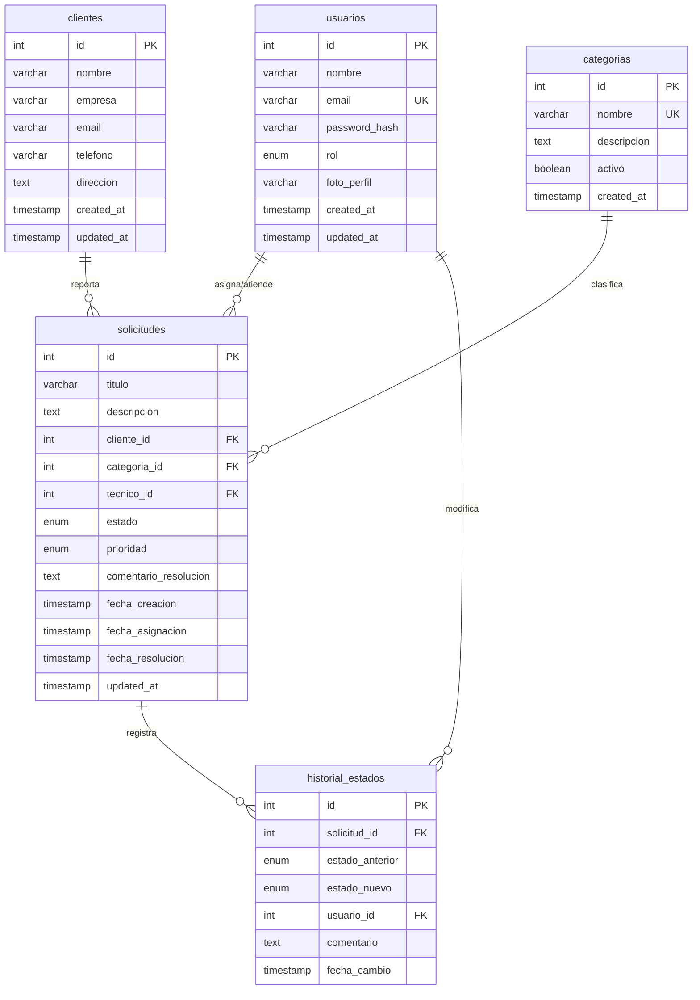
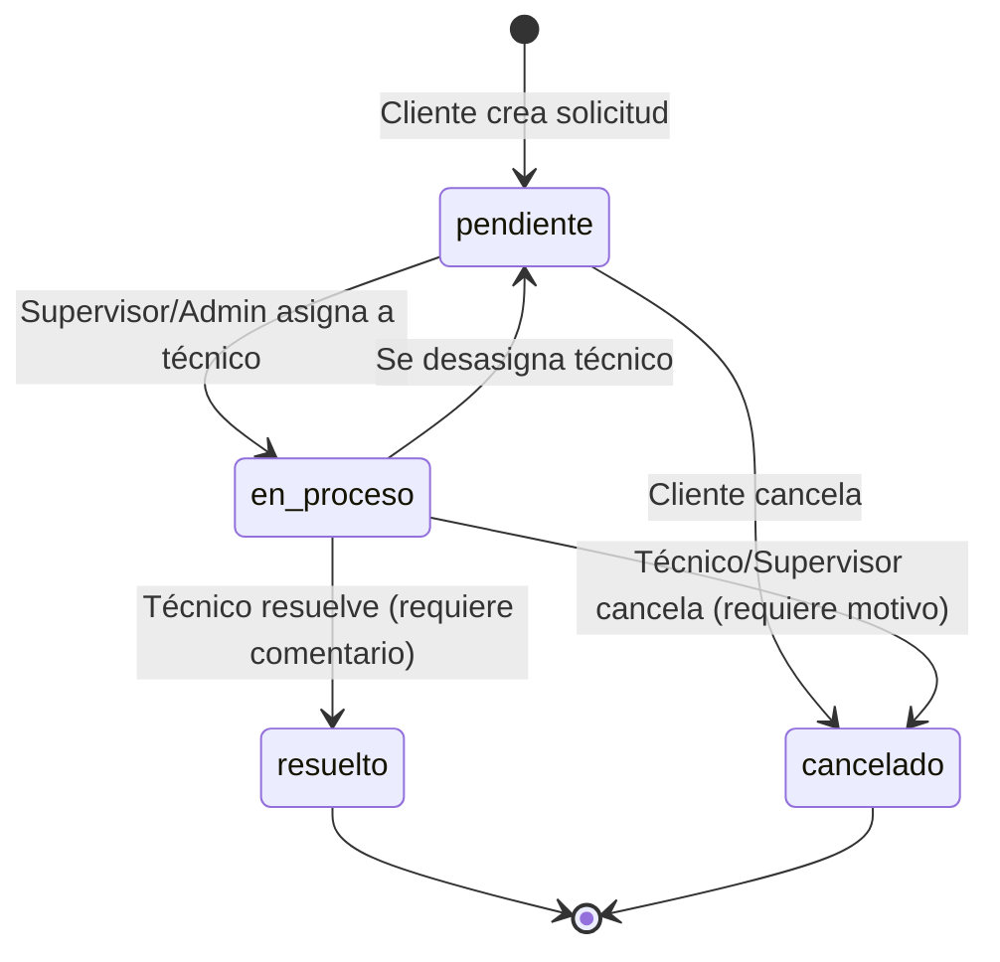

# Diseño Técnico: Sistema de Gestión de Solicitudes de Soporte Técnico

## Overview

El Sistema de Gestión de Solicitudes de Soporte Técnico es una aplicación web empresarial que permite registrar clientes, crear casos de soporte, asignarlos a técnicos y realizar seguimiento completo del estado de cada solicitud. El sistema implementa control de acceso basado en roles (RBAC) con cuatro niveles jerárquicos: Cliente, Técnico, Supervisor y Administrador.

**Contexto de Despliegue:** El sistema está diseñado para ejecutarse completamente en entorno local (localhost) durante desarrollo y pruebas. Todos los componentes (frontend, backend, base de datos) corren en la misma máquina, lo que simplifica la configuración inicial y permite desarrollo ágil sin necesidad de infraestructura cloud.

**Stack Tecnológico:**
- **Backend:** Node.js v18+ con Express.js 4.x
- **Base de Datos:** MySQL 8.0+ (gestionada con DBeaver)
- **Frontend:** HTML5, CSS3, JavaScript ES6+ (vanilla, sin frameworks)
- **Autenticación:** JSON Web Tokens (JWT) almacenados en localStorage del navegador
- **Gestión de Archivos:** Multer para carga de fotos de perfil
- **Seguridad:** bcrypt para hashing de contraseñas, consultas parametrizadas

**Características Principales:**
1. **Autenticación y Autorización:** Sistema JWT con control de acceso basado en roles
2. **Gestión de Usuarios:** CRUD completo con soporte para fotos de perfil
3. **Gestión de Clientes:** Registro y seguimiento de solicitantes de soporte
4. **Sistema de Tickets:** Creación, asignación y seguimiento de solicitudes
5. **Categorización:** Clasificación de problemas por tipo (Red, Hardware, Software, etc.)
6. **Flujo de Estados:** Transiciones controladas (Pendiente → En Proceso → Resuelto/Cancelado)
7. **Reportes y Estadísticas:** Historial de atención por cliente y técnico
8. **Búsqueda y Filtrado:** Consultas avanzadas con múltiples criterios

**Principios de Diseño Aplicados:**
- **SOLID:** Separación de responsabilidades en capas bien definidas
- **Clean Code:** Funciones cortas, nombres descriptivos, sin duplicación
- **Repository Pattern:** Abstracción de acceso a datos
- **Dependency Injection:** Desacoplamiento entre capas
- **Error Handling Centralizado:** Middleware global para manejo consistente de errores


## Architecture

### Arquitectura de 3 Capas

El sistema sigue una arquitectura de 3 capas claramente separadas, donde cada capa tiene responsabilidades específicas y se comunica únicamente con las capas adyacentes:

```
┌─────────────────────────────────────────────────────────────┐
│                     CAPA DE PRESENTACIÓN                     │
│                    (Frontend - Cliente)                      │
│                                                               │
│  ┌──────────────┐  ┌──────────────┐  ┌──────────────┐      │
│  │   HTML/CSS   │  │  JavaScript  │  │ LocalStorage │      │
│  │    Pages     │  │   Modules    │  │  (JWT Token) │      │
│  └──────────────┘  └──────────────┘  └──────────────┘      │
│                                                               │
│         ↓ HTTP/HTTPS (fetch API)                            │
└─────────────────────────────────────────────────────────────┘
                              ↓
┌─────────────────────────────────────────────────────────────┐
│                    CAPA DE LÓGICA DE NEGOCIO                 │
│                  (Backend - Node.js/Express)                 │
│                                                               │
│  ┌──────────────────────────────────────────────────────┐   │
│  │                    Routes Layer                       │   │
│  │  (Define endpoints y mapea a controllers)            │   │
│  └──────────────────────────────────────────────────────┘   │
│                              ↓                                │
│  ┌──────────────────────────────────────────────────────┐   │
│  │                 Middlewares Layer                     │   │
│  │  (Auth, Validation, Error Handling, File Upload)     │   │
│  └──────────────────────────────────────────────────────┘   │
│                              ↓                                │
│  ┌──────────────────────────────────────────────────────┐   │
│  │                 Controllers Layer                     │   │
│  │  (Maneja HTTP requests/responses)                    │   │
│  └──────────────────────────────────────────────────────┘   │
│                              ↓                                │
│  ┌──────────────────────────────────────────────────────┐   │
│  │                  Services Layer                       │   │
│  │  (Lógica de negocio pura, sin dependencia de HTTP)   │   │
│  └──────────────────────────────────────────────────────┘   │
│                              ↓                                │
│  ┌──────────────────────────────────────────────────────┐   │
│  │                Repositories Layer                     │   │
│  │  (Acceso a datos, queries SQL)                       │   │
│  └──────────────────────────────────────────────────────┘   │
│                                                               │
│         ↓ MySQL2 Connection Pool                             │
└─────────────────────────────────────────────────────────────┘
                              ↓
┌─────────────────────────────────────────────────────────────┐
│                      CAPA DE DATOS                           │
│                      (MySQL Database)                        │
│                                                               │
│  ┌──────────┐  ┌──────────┐  ┌──────────┐  ┌──────────┐   │
│  │ usuarios │  │ clientes │  │solicitudes│  │categorias│   │
│  └──────────┘  └──────────┘  └──────────┘  └──────────┘   │
│                                                               │
│  ┌──────────────────────┐                                    │
│  │  historial_estados   │                                    │
│  └──────────────────────┘                                    │
└─────────────────────────────────────────────────────────────┘
```

### Flujo de Datos

**Flujo de Autenticación (Login):**
```
1. Usuario ingresa credenciales en formulario HTML
2. Frontend envía POST /api/auth/login con {email, password}
3. Backend (AuthController) recibe request
4. AuthService valida credenciales contra base de datos
5. Si válido: genera JWT con payload {id, email, rol, exp}
6. Backend retorna {success: true, token: "jwt...", user: {...}}
7. Frontend almacena token en localStorage
8. Frontend redirige según rol del usuario
```

**Flujo de Request Protegido:**
```
1. Frontend lee token de localStorage
2. Frontend envía request con header: Authorization: Bearer <token>
3. Middleware authMiddleware intercepta request
4. Middleware verifica y decodifica JWT
5. Si válido: agrega req.user = {id, email, rol} y continúa
6. Si inválido/expirado: retorna 401 Unauthorized
7. Middleware roleMiddleware verifica permisos
8. Si autorizado: continúa a controller
9. Si no autorizado: retorna 403 Forbidden
10. Controller → Service → Repository → MySQL
11. Respuesta fluye de vuelta: Repository → Service → Controller
12. Controller retorna JSON estandarizado al frontend
```

### Autenticación JWT en Entorno Local

**¿Por qué JWT funciona perfectamente en localhost?**

JWT (JSON Web Token) es un estándar de autenticación stateless que funciona independientemente del entorno de despliegue. En localhost:

1. **El navegador almacena el token en localStorage:** Esta API del navegador funciona igual en localhost que en producción
2. **El token se envía en headers HTTP:** Los headers Authorization funcionan idénticamente en http://localhost:3000 que en https://produccion.com
3. **El servidor valida el token:** La verificación criptográfica del JWT es la misma sin importar el origen
4. **No requiere HTTPS para funcionar:** Aunque HTTPS es recomendado en producción, JWT funciona perfectamente con HTTP en desarrollo local

**Flujo JWT en Localhost:**
```
┌─────────────────────────────────────────────────────────────┐
│  Navegador (http://localhost:5500)                          │
│                                                               │
│  1. Login exitoso                                            │
│  2. localStorage.setItem('token', 'eyJhbGc...')             │
│  3. Token almacenado en memoria del navegador               │
│                                                               │
│  4. Cada request posterior:                                  │
│     const token = localStorage.getItem('token')             │
│     fetch('http://localhost:3000/api/solicitudes', {        │
│       headers: { 'Authorization': `Bearer ${token}` }       │
│     })                                                        │
└─────────────────────────────────────────────────────────────┘
                              ↓
┌─────────────────────────────────────────────────────────────┐
│  Servidor Express (http://localhost:3000)                   │
│                                                               │
│  5. Middleware extrae token del header                       │
│  6. jwt.verify(token, SECRET_KEY)                           │
│  7. Si válido: decodifica payload {id, email, rol}          │
│  8. Agrega datos a req.user                                  │
│  9. Continúa procesamiento normal                            │
└─────────────────────────────────────────────────────────────┘
```

**Configuración CORS para Desarrollo Local:**

Como el frontend (puerto 5500) y backend (puerto 3000) corren en puertos diferentes, se requiere configuración CORS:

```javascript
// backend/src/config/cors.js
const corsOptions = {
  origin: 'http://localhost:5500', // Puerto del frontend
  credentials: true,
  optionsSuccessStatus: 200
};
```

### Principios SOLID Aplicados

**1. Single Responsibility Principle (SRP)**
- **Repository:** Solo acceso a datos (queries SQL)
- **Service:** Solo lógica de negocio
- **Controller:** Solo manejo de HTTP
- **Middleware:** Solo validación/autenticación

**2. Open/Closed Principle (OCP)**
- Middlewares extensibles sin modificar código existente
- Nuevos roles se agregan sin cambiar lógica de autorización
- Nuevas categorías se configuran en base de datos, no en código

**3. Liskov Substitution Principle (LSP)**
- Todos los repositories implementan interfaz consistente
- Todos los services retornan formato estandarizado
- Cualquier repository puede reemplazarse sin afectar services

**4. Interface Segregation Principle (ISP)**
- Services específicos por dominio (UserService, SolicitudService)
- Repositories específicos por entidad
- No hay "super service" con métodos no relacionados

**5. Dependency Inversion Principle (DIP)**
- Controllers dependen de abstracciones (services), no implementaciones
- Services dependen de abstracciones (repositories), no queries directas
- Inyección de dependencias en constructores


## Components and Interfaces

### Estructura de Carpetas del Proyecto

```
soporte-tecnico-system/
├── backend/
│   ├── src/
│   │   ├── config/
│   │   │   ├── database.js          # Pool de conexiones MySQL
│   │   │   ├── jwt.js               # Configuración JWT (secret, expiration)
│   │   │   └── cors.js              # Configuración CORS para localhost
│   │   │
│   │   ├── middlewares/
│   │   │   ├── authMiddleware.js    # Verificación de JWT
│   │   │   ├── roleMiddleware.js    # Verificación de permisos por rol
│   │   │   ├── validationMiddleware.js  # Validación de datos de entrada
│   │   │   ├── errorMiddleware.js   # Manejo centralizado de errores
│   │   │   └── uploadMiddleware.js  # Configuración multer para fotos
│   │   │
│   │   ├── repositories/
│   │   │   ├── userRepository.js    # Queries de usuarios
│   │   │   ├── clienteRepository.js # Queries de clientes
│   │   │   ├── solicitudRepository.js  # Queries de solicitudes
│   │   │   ├── categoriaRepository.js  # Queries de categorías
│   │   │   └── historialRepository.js  # Queries de historial
│   │   │
│   │   ├── services/
│   │   │   ├── authService.js       # Lógica de autenticación
│   │   │   ├── userService.js       # Lógica de negocio usuarios
│   │   │   ├── clienteService.js    # Lógica de negocio clientes
│   │   │   ├── solicitudService.js  # Lógica de negocio solicitudes
│   │   │   └── categoriaService.js  # Lógica de negocio categorías
│   │   │
│   │   ├── controllers/
│   │   │   ├── authController.js    # Endpoints de autenticación
│   │   │   ├── userController.js    # Endpoints de usuarios
│   │   │   ├── clienteController.js # Endpoints de clientes
│   │   │   ├── solicitudController.js  # Endpoints de solicitudes
│   │   │   └── categoriaController.js  # Endpoints de categorías
│   │   │
│   │   ├── routes/
│   │   │   ├── authRoutes.js        # Rutas de autenticación
│   │   │   ├── userRoutes.js        # Rutas de usuarios
│   │   │   ├── clienteRoutes.js     # Rutas de clientes
│   │   │   ├── solicitudRoutes.js   # Rutas de solicitudes
│   │   │   ├── categoriaRoutes.js   # Rutas de categorías
│   │   │   └── index.js             # Agregador de rutas
│   │   │
│   │   ├── utils/
│   │   │   ├── responseFormatter.js # Formato estandarizado de respuestas
│   │   │   ├── validators.js        # Funciones de validación reutilizables
│   │   │   └── fileHelper.js        # Utilidades para manejo de archivos
│   │   │
│   │   └── app.js                   # Configuración de Express
│   │
│   ├── uploads/
│   │   └── profiles/                # Fotos de perfil de usuarios
│   │
│   ├── .env                         # Variables de entorno (NO en git)
│   ├── .env.example                 # Plantilla de variables de entorno
│   ├── .gitignore
│   ├── package.json
│   └── server.js                    # Punto de entrada de la aplicación
│
├── frontend/
│   ├── pages/
│   │   ├── login.html               # Página de inicio de sesión
│   │   ├── dashboard.html           # Dashboard principal
│   │   ├── usuarios.html            # Gestión de usuarios
│   │   ├── clientes.html            # Gestión de clientes
│   │   ├── solicitudes.html         # Lista de solicitudes
│   │   ├── nueva-solicitud.html     # Formulario nueva solicitud
│   │   ├── detalle-solicitud.html   # Detalle de solicitud
│   │   └── perfil.html              # Perfil de usuario
│   │
│   ├── js/
│   │   ├── api/
│   │   │   ├── authApi.js           # Llamadas API de autenticación
│   │   │   ├── userApi.js           # Llamadas API de usuarios
│   │   │   ├── clienteApi.js        # Llamadas API de clientes
│   │   │   └── solicitudApi.js      # Llamadas API de solicitudes
│   │   │
│   │   ├── utils/
│   │   │   ├── auth.js              # Manejo de token y sesión
│   │   │   ├── validation.js        # Validaciones del lado cliente
│   │   │   ├── dom.js               # Utilidades DOM
│   │   │   └── formatter.js         # Formateo de datos
│   │   │
│   │   ├── components/
│   │   │   ├── navbar.js            # Menú de navegación dinámico
│   │   │   ├── table.js             # Componente de tabla reutilizable
│   │   │   └── modal.js             # Componente de modal
│   │   │
│   │   └── pages/
│   │       ├── login.js             # Lógica página login
│   │       ├── dashboard.js         # Lógica página dashboard
│   │       ├── usuarios.js          # Lógica página usuarios
│   │       ├── solicitudes.js       # Lógica página solicitudes
│   │       └── perfil.js            # Lógica página perfil
│   │
│   ├── css/
│   │   ├── main.css                 # Estilos globales
│   │   ├── components.css           # Estilos de componentes
│   │   └── pages.css                # Estilos específicos de páginas
│   │
│   └── assets/
│       ├── images/
│       │   └── default-avatar.png   # Avatar por defecto
│       └── icons/
│
├── database/
│   ├── schema.sql                   # Script de creación de base de datos
│   └── seed.sql                     # Datos iniciales (opcional)
│
├── docs/
│   ├── README.md                    # Documentación principal
│   ├── INSTALLATION.md              # Guía de instalación
│   ├── API.md                       # Documentación de endpoints
│   └── USER_MANUAL.md               # Manual de usuario
│
└── .gitignore
```

### Componentes Backend

#### 1. Config Layer

**database.js - Pool de Conexiones MySQL**
```javascript
// Responsabilidad: Gestionar conexiones a MySQL eficientemente
// Principio SOLID: SRP - Solo configuración de base de datos

const mysql = require('mysql2/promise');

const pool = mysql.createPool({
  host: process.env.DB_HOST || 'localhost',
  user: process.env.DB_USER || 'root',
  password: process.env.DB_PASSWORD,
  database: process.env.DB_NAME || 'soporte_tecnico',
  waitForConnections: true,
  connectionLimit: 20,      // Máximo 20 conexiones simultáneas
  queueLimit: 0,            // Sin límite de cola
  enableKeepAlive: true,
  keepAliveInitialDelay: 0
});

// Verificar conexión al iniciar
pool.getConnection()
  .then(connection => {
    console.log('✓ Conexión a MySQL establecida');
    connection.release();
  })
  .catch(err => {
    console.error('✗ Error conectando a MySQL:', err.message);
    process.exit(1);
  });

module.exports = pool;
```

**jwt.js - Configuración JWT**
```javascript
// Responsabilidad: Configuración centralizada de JWT
// Principio SOLID: SRP - Solo configuración de tokens

module.exports = {
  secret: process.env.JWT_SECRET || 'your-secret-key-change-in-production',
  expiresIn: '8h',  // Token expira en 8 horas
  algorithm: 'HS256'
};
```

#### 2. Middlewares Layer

**authMiddleware.js - Verificación de JWT**
```javascript
// Responsabilidad: Verificar que el usuario esté autenticado
// Principio SOLID: SRP - Solo autenticación

const jwt = require('jsonwebtoken');
const jwtConfig = require('../config/jwt');
const { formatError } = require('../utils/responseFormatter');

const authMiddleware = (req, res, next) => {
  try {
    // Extraer token del header Authorization
    const authHeader = req.headers.authorization;
    
    if (!authHeader || !authHeader.startsWith('Bearer ')) {
      return res.status(401).json(
        formatError('Token no proporcionado')
      );
    }

    const token = authHeader.substring(7); // Remover 'Bearer '

    // Verificar y decodificar token
    const decoded = jwt.verify(token, jwtConfig.secret);
    
    // Agregar información del usuario al request
    req.user = {
      id: decoded.id,
      email: decoded.email,
      rol: decoded.rol
    };

    next();
  } catch (error) {
    if (error.name === 'TokenExpiredError') {
      return res.status(401).json(
        formatError('Token expirado')
      );
    }
    return res.status(401).json(
      formatError('Token inválido')
    );
  }
};

module.exports = authMiddleware;
```

**roleMiddleware.js - Verificación de Permisos**
```javascript
// Responsabilidad: Verificar que el usuario tenga el rol requerido
// Principio SOLID: SRP - Solo autorización por rol

const { formatError } = require('../utils/responseFormatter');

// Factory function para crear middleware de rol
const requireRole = (...allowedRoles) => {
  return (req, res, next) => {
    if (!req.user) {
      return res.status(401).json(
        formatError('Usuario no autenticado')
      );
    }

    if (!allowedRoles.includes(req.user.rol)) {
      return res.status(403).json(
        formatError('No tiene permisos para acceder a este recurso')
      );
    }

    next();
  };
};

module.exports = { requireRole };
```

**uploadMiddleware.js - Configuración Multer**
```javascript
// Responsabilidad: Configurar carga de archivos
// Principio SOLID: SRP - Solo manejo de uploads

const multer = require('multer');
const path = require('path');
const { v4: uuidv4 } = require('uuid');

// Configuración de almacenamiento
const storage = multer.diskStorage({
  destination: (req, file, cb) => {
    cb(null, 'uploads/profiles/');
  },
  filename: (req, file, cb) => {
    const uniqueName = `${uuidv4()}${path.extname(file.originalname)}`;
    cb(null, uniqueName);
  }
});

// Filtro de tipos de archivo
const fileFilter = (req, file, cb) => {
  const allowedTypes = ['image/jpeg', 'image/jpg', 'image/png'];
  
  if (allowedTypes.includes(file.mimetype)) {
    cb(null, true);
  } else {
    cb(new Error('Tipo de archivo no permitido. Solo JPG, JPEG y PNG'), false);
  }
};

// Configuración de multer
const upload = multer({
  storage: storage,
  fileFilter: fileFilter,
  limits: {
    fileSize: 5 * 1024 * 1024 // 5 MB máximo
  }
});

module.exports = upload;
```

#### 3. Repository Layer

**userRepository.js - Acceso a Datos de Usuarios**
```javascript
// Responsabilidad: Ejecutar queries SQL relacionadas con usuarios
// Principio SOLID: SRP - Solo acceso a datos de usuarios

const pool = require('../config/database');

class UserRepository {
  // Crear usuario
  async create(userData) {
    const query = `
      INSERT INTO usuarios (nombre, email, password_hash, rol, foto_perfil, created_at)
      VALUES (?, ?, ?, ?, ?, NOW())
    `;
    const [result] = await pool.execute(query, [
      userData.nombre,
      userData.email,
      userData.password_hash,
      userData.rol,
      userData.foto_perfil || null
    ]);
    return result.insertId;
  }

  // Buscar por email
  async findByEmail(email) {
    const query = 'SELECT * FROM usuarios WHERE email = ?';
    const [rows] = await pool.execute(query, [email]);
    return rows[0] || null;
  }

  // Buscar por ID
  async findById(id) {
    const query = 'SELECT id, nombre, email, rol, foto_perfil, created_at FROM usuarios WHERE id = ?';
    const [rows] = await pool.execute(query, [id]);
    return rows[0] || null;
  }

  // Listar usuarios con filtros
  async findAll(filters = {}) {
    let query = 'SELECT id, nombre, email, rol, foto_perfil, created_at FROM usuarios WHERE 1=1';
    const params = [];

    if (filters.rol) {
      query += ' AND rol = ?';
      params.push(filters.rol);
    }

    if (filters.search) {
      query += ' AND (nombre LIKE ? OR email LIKE ?)';
      params.push(`%${filters.search}%`, `%${filters.search}%`);
    }

    query += ' ORDER BY created_at DESC';

    const [rows] = await pool.execute(query, params);
    return rows;
  }

  // Actualizar usuario
  async update(id, userData) {
    const query = `
      UPDATE usuarios 
      SET nombre = ?, rol = ?, foto_perfil = ?, updated_at = NOW()
      WHERE id = ?
    `;
    const [result] = await pool.execute(query, [
      userData.nombre,
      userData.rol,
      userData.foto_perfil,
      id
    ]);
    return result.affectedRows > 0;
  }

  // Eliminar usuario
  async delete(id) {
    const query = 'DELETE FROM usuarios WHERE id = ?';
    const [result] = await pool.execute(query, [id]);
    return result.affectedRows > 0;
  }

  // Verificar si tiene solicitudes activas
  async hasActiveSolicitudes(id) {
    const query = `
      SELECT COUNT(*) as count 
      FROM solicitudes 
      WHERE tecnico_id = ? AND estado IN ('pendiente', 'en_proceso')
    `;
    const [rows] = await pool.execute(query, [id]);
    return rows[0].count > 0;
  }
}

module.exports = new UserRepository();
```

#### 4. Service Layer

**authService.js - Lógica de Autenticación**
```javascript
// Responsabilidad: Lógica de negocio de autenticación
// Principio SOLID: SRP - Solo lógica de auth, sin HTTP

const bcrypt = require('bcrypt');
const jwt = require('jsonwebtoken');
const userRepository = require('../repositories/userRepository');
const jwtConfig = require('../config/jwt');

class AuthService {
  // Login
  async login(email, password) {
    // Buscar usuario
    const user = await userRepository.findByEmail(email);
    
    if (!user) {
      throw new Error('Credenciales inválidas');
    }

    // Verificar contraseña
    const isValidPassword = await bcrypt.compare(password, user.password_hash);
    
    if (!isValidPassword) {
      throw new Error('Credenciales inválidas');
    }

    // Generar token
    const token = jwt.sign(
      {
        id: user.id,
        email: user.email,
        rol: user.rol
      },
      jwtConfig.secret,
      { expiresIn: jwtConfig.expiresIn }
    );

    // Retornar token y datos del usuario (sin password)
    return {
      token,
      user: {
        id: user.id,
        nombre: user.nombre,
        email: user.email,
        rol: user.rol,
        foto_perfil: user.foto_perfil
      }
    };
  }

  // Registro
  async register(userData) {
    // Verificar si el email ya existe
    const existingUser = await userRepository.findByEmail(userData.email);
    
    if (existingUser) {
      throw new Error('El email ya está registrado');
    }

    // Hashear contraseña
    const password_hash = await bcrypt.hash(userData.password, 10);

    // Crear usuario
    const userId = await userRepository.create({
      ...userData,
      password_hash
    });

    // Obtener usuario creado
    const user = await userRepository.findById(userId);

    return {
      id: user.id,
      nombre: user.nombre,
      email: user.email,
      rol: user.rol
    };
  }
}

module.exports = new AuthService();
```

#### 5. Controller Layer

**authController.js - Endpoints de Autenticación**
```javascript
// Responsabilidad: Manejar requests HTTP de autenticación
// Principio SOLID: SRP - Solo manejo de HTTP, delega a service

const authService = require('../services/authService');
const { formatSuccess, formatError } = require('../utils/responseFormatter');

class AuthController {
  // POST /api/auth/login
  async login(req, res, next) {
    try {
      const { email, password } = req.body;

      // Validar campos requeridos
      if (!email || !password) {
        return res.status(400).json(
          formatError('Email y contraseña son requeridos')
        );
      }

      // Delegar a service
      const result = await authService.login(email, password);

      res.status(200).json(
        formatSuccess('Login exitoso', result)
      );
    } catch (error) {
      next(error);
    }
  }

  // POST /api/auth/register
  async register(req, res, next) {
    try {
      const userData = req.body;

      // Validaciones básicas
      if (!userData.email || !userData.password || !userData.nombre) {
        return res.status(400).json(
          formatError('Campos requeridos: nombre, email, password')
        );
      }

      // Delegar a service
      const user = await authService.register(userData);

      res.status(201).json(
        formatSuccess('Usuario registrado exitosamente', user)
      );
    } catch (error) {
      next(error);
    }
  }

  // POST /api/auth/logout
  async logout(req, res) {
    // En JWT stateless, el logout se maneja en el cliente
    // eliminando el token de localStorage
    res.status(200).json(
      formatSuccess('Logout exitoso')
    );
  }
}

module.exports = new AuthController();
```

#### 6. Routes Layer

**authRoutes.js - Definición de Rutas**
```javascript
// Responsabilidad: Definir endpoints y mapear a controllers
// Principio SOLID: SRP - Solo definición de rutas

const express = require('express');
const router = express.Router();
const authController = require('../controllers/authController');
const authMiddleware = require('../middlewares/authMiddleware');

// Rutas públicas
router.post('/login', authController.login);
router.post('/register', authController.register);

// Rutas protegidas
router.post('/logout', authMiddleware, authController.logout);

module.exports = router;
```

### Componentes Frontend

#### API Layer

**authApi.js - Llamadas API de Autenticación**
```javascript
// Responsabilidad: Comunicación con backend para autenticación
// Principio SOLID: SRP - Solo llamadas API de auth

const API_URL = 'http://localhost:3000/api';

const authApi = {
  // Login
  async login(email, password) {
    const response = await fetch(`${API_URL}/auth/login`, {
      method: 'POST',
      headers: {
        'Content-Type': 'application/json'
      },
      body: JSON.stringify({ email, password })
    });

    const data = await response.json();

    if (!response.ok) {
      throw new Error(data.message || 'Error en login');
    }

    return data;
  },

  // Logout
  async logout() {
    const token = localStorage.getItem('token');
    
    const response = await fetch(`${API_URL}/auth/logout`, {
      method: 'POST',
      headers: {
        'Authorization': `Bearer ${token}`
      }
    });

    return response.json();
  }
};
```

#### Utils Layer

**auth.js - Manejo de Sesión**
```javascript
// Responsabilidad: Gestionar token y sesión del usuario
// Principio SOLID: SRP - Solo manejo de sesión

const auth = {
  // Guardar token
  setToken(token) {
    localStorage.setItem('token', token);
  },

  // Obtener token
  getToken() {
    return localStorage.getItem('token');
  },

  // Eliminar token
  removeToken() {
    localStorage.removeItem('token');
  },

  // Verificar si está autenticado
  isAuthenticated() {
    return !!this.getToken();
  },

  // Decodificar token (sin verificar firma)
  decodeToken() {
    const token = this.getToken();
    if (!token) return null;

    try {
      const base64Url = token.split('.')[1];
      const base64 = base64Url.replace(/-/g, '+').replace(/_/g, '/');
      const jsonPayload = decodeURIComponent(
        atob(base64).split('').map(c => {
          return '%' + ('00' + c.charCodeAt(0).toString(16)).slice(-2);
        }).join('')
      );

      return JSON.parse(jsonPayload);
    } catch (error) {
      return null;
    }
  },

  // Obtener rol del usuario
  getUserRole() {
    const decoded = this.decodeToken();
    return decoded ? decoded.rol : null;
  },

  // Verificar si el token expiró
  isTokenExpired() {
    const decoded = this.decodeToken();
    if (!decoded || !decoded.exp) return true;

    const currentTime = Date.now() / 1000;
    return decoded.exp < currentTime;
  },

  // Redirigir a login si no autenticado
  requireAuth() {
    if (!this.isAuthenticated() || this.isTokenExpired()) {
      this.removeToken();
      window.location.href = '/pages/login.html';
      return false;
    }
    return true;
  }
};
```


## Data Models

### Diagrama Entidad-Relación (ER)



### Esquema de Base de Datos MySQL

#### Tabla: usuarios

```sql
CREATE TABLE usuarios (
  id INT AUTO_INCREMENT PRIMARY KEY,
  nombre VARCHAR(100) NOT NULL,
  email VARCHAR(100) NOT NULL UNIQUE,
  password_hash VARCHAR(255) NOT NULL,
  rol ENUM('cliente', 'tecnico', 'supervisor', 'administrador') NOT NULL DEFAULT 'cliente',
  foto_perfil VARCHAR(255) NULL,
  created_at TIMESTAMP DEFAULT CURRENT_TIMESTAMP,
  updated_at TIMESTAMP DEFAULT CURRENT_TIMESTAMP ON UPDATE CURRENT_TIMESTAMP,
  
  INDEX idx_email (email),
  INDEX idx_rol (rol)
) ENGINE=InnoDB DEFAULT CHARSET=utf8mb4 COLLATE=utf8mb4_unicode_ci;
```

**Descripción de Campos:**
- `id`: Identificador único del usuario
- `nombre`: Nombre completo del usuario
- `email`: Correo electrónico (único, usado para login)
- `password_hash`: Contraseña hasheada con bcrypt (factor 10)
- `rol`: Rol del usuario (cliente, tecnico, supervisor, administrador)
- `foto_perfil`: Ruta relativa a la foto de perfil (nullable)
- `created_at`: Fecha de creación del registro
- `updated_at`: Fecha de última actualización

**Índices:**
- `idx_email`: Optimiza búsquedas por email (login)
- `idx_rol`: Optimiza filtros por rol

#### Tabla: clientes

```sql
CREATE TABLE clientes (
  id INT AUTO_INCREMENT PRIMARY KEY,
  nombre VARCHAR(100) NOT NULL,
  empresa VARCHAR(100) NULL,
  email VARCHAR(100) NOT NULL,
  telefono VARCHAR(20) NULL,
  direccion TEXT NULL,
  created_at TIMESTAMP DEFAULT CURRENT_TIMESTAMP,
  updated_at TIMESTAMP DEFAULT CURRENT_TIMESTAMP ON UPDATE CURRENT_TIMESTAMP,
  
  INDEX idx_nombre (nombre),
  INDEX idx_empresa (empresa),
  INDEX idx_email (email)
) ENGINE=InnoDB DEFAULT CHARSET=utf8mb4 COLLATE=utf8mb4_unicode_ci;
```

**Descripción de Campos:**
- `id`: Identificador único del cliente
- `nombre`: Nombre completo del cliente/solicitante
- `empresa`: Nombre de la empresa (opcional)
- `email`: Correo electrónico de contacto
- `telefono`: Número de teléfono (opcional)
- `direccion`: Dirección física (opcional)

**Índices:**
- `idx_nombre`: Optimiza búsquedas por nombre
- `idx_empresa`: Optimiza búsquedas por empresa
- `idx_email`: Optimiza búsquedas por email

#### Tabla: categorias

```sql
CREATE TABLE categorias (
  id INT AUTO_INCREMENT PRIMARY KEY,
  nombre VARCHAR(50) NOT NULL UNIQUE,
  descripcion TEXT NULL,
  activo BOOLEAN DEFAULT TRUE,
  created_at TIMESTAMP DEFAULT CURRENT_TIMESTAMP,
  
  INDEX idx_activo (activo)
) ENGINE=InnoDB DEFAULT CHARSET=utf8mb4 COLLATE=utf8mb4_unicode_ci;
```

**Descripción de Campos:**
- `id`: Identificador único de la categoría
- `nombre`: Nombre de la categoría (único)
- `descripcion`: Descripción detallada de la categoría
- `activo`: Indica si la categoría está activa (soft delete)

**Categorías Predefinidas:**
- Red
- Hardware
- Software
- Impresoras
- Acceso a Sistemas
- Correo Electrónico

#### Tabla: solicitudes

```sql
CREATE TABLE solicitudes (
  id INT AUTO_INCREMENT PRIMARY KEY,
  titulo VARCHAR(200) NOT NULL,
  descripcion TEXT NOT NULL,
  cliente_id INT NOT NULL,
  categoria_id INT NOT NULL,
  tecnico_id INT NULL,
  estado ENUM('pendiente', 'en_proceso', 'resuelto', 'cancelado') NOT NULL DEFAULT 'pendiente',
  prioridad ENUM('baja', 'media', 'alta', 'critica') NOT NULL DEFAULT 'media',
  comentario_resolucion TEXT NULL,
  fecha_creacion TIMESTAMP DEFAULT CURRENT_TIMESTAMP,
  fecha_asignacion TIMESTAMP NULL,
  fecha_resolucion TIMESTAMP NULL,
  updated_at TIMESTAMP DEFAULT CURRENT_TIMESTAMP ON UPDATE CURRENT_TIMESTAMP,
  
  FOREIGN KEY (cliente_id) REFERENCES clientes(id) ON DELETE RESTRICT,
  FOREIGN KEY (categoria_id) REFERENCES categorias(id) ON DELETE RESTRICT,
  FOREIGN KEY (tecnico_id) REFERENCES usuarios(id) ON DELETE SET NULL,
  
  INDEX idx_cliente (cliente_id),
  INDEX idx_tecnico (tecnico_id),
  INDEX idx_estado (estado),
  INDEX idx_prioridad (prioridad),
  INDEX idx_categoria (categoria_id),
  INDEX idx_fecha_creacion (fecha_creacion),
  INDEX idx_estado_tecnico (estado, tecnico_id)
) ENGINE=InnoDB DEFAULT CHARSET=utf8mb4 COLLATE=utf8mb4_unicode_ci;
```

**Descripción de Campos:**
- `id`: Identificador único de la solicitud
- `titulo`: Título breve de la solicitud (mínimo 5 caracteres)
- `descripcion`: Descripción detallada del problema (mínimo 10 caracteres)
- `cliente_id`: Referencia al cliente que reporta
- `categoria_id`: Referencia a la categoría del problema
- `tecnico_id`: Referencia al técnico asignado (nullable)
- `estado`: Estado actual (pendiente, en_proceso, resuelto, cancelado)
- `prioridad`: Nivel de urgencia (baja, media, alta, critica)
- `comentario_resolucion`: Comentario del técnico al resolver (requerido al resolver)
- `fecha_creacion`: Fecha de creación de la solicitud
- `fecha_asignacion`: Fecha de asignación a técnico
- `fecha_resolucion`: Fecha de resolución o cancelación

**Restricciones:**
- `ON DELETE RESTRICT` en cliente y categoría: No se puede eliminar si tiene solicitudes
- `ON DELETE SET NULL` en técnico: Si se elimina técnico, solicitud queda sin asignar

**Índices:**
- `idx_estado_tecnico`: Índice compuesto para consultas de técnicos por estado
- Índices individuales para optimizar filtros y búsquedas

#### Tabla: historial_estados

```sql
CREATE TABLE historial_estados (
  id INT AUTO_INCREMENT PRIMARY KEY,
  solicitud_id INT NOT NULL,
  estado_anterior ENUM('pendiente', 'en_proceso', 'resuelto', 'cancelado') NULL,
  estado_nuevo ENUM('pendiente', 'en_proceso', 'resuelto', 'cancelado') NOT NULL,
  usuario_id INT NOT NULL,
  comentario TEXT NULL,
  fecha_cambio TIMESTAMP DEFAULT CURRENT_TIMESTAMP,
  
  FOREIGN KEY (solicitud_id) REFERENCES solicitudes(id) ON DELETE CASCADE,
  FOREIGN KEY (usuario_id) REFERENCES usuarios(id) ON DELETE RESTRICT,
  
  INDEX idx_solicitud (solicitud_id),
  INDEX idx_fecha (fecha_cambio)
) ENGINE=InnoDB DEFAULT CHARSET=utf8mb4 COLLATE=utf8mb4_unicode_ci;
```

**Descripción de Campos:**
- `id`: Identificador único del registro de historial
- `solicitud_id`: Referencia a la solicitud
- `estado_anterior`: Estado previo (NULL en creación)
- `estado_nuevo`: Nuevo estado
- `usuario_id`: Usuario que realizó el cambio
- `comentario`: Comentario opcional sobre el cambio
- `fecha_cambio`: Timestamp del cambio

**Restricciones:**
- `ON DELETE CASCADE` en solicitud: Si se elimina solicitud, se elimina historial
- `ON DELETE RESTRICT` en usuario: No se puede eliminar usuario con historial

### Relaciones entre Entidades

**1. usuarios → solicitudes (1:N)**
- Un usuario (técnico) puede tener múltiples solicitudes asignadas
- Una solicitud puede tener un solo técnico asignado (o ninguno)
- Relación: `solicitudes.tecnico_id → usuarios.id`

**2. clientes → solicitudes (1:N)**
- Un cliente puede reportar múltiples solicitudes
- Una solicitud pertenece a un solo cliente
- Relación: `solicitudes.cliente_id → clientes.id`

**3. categorias → solicitudes (1:N)**
- Una categoría puede clasificar múltiples solicitudes
- Una solicitud pertenece a una sola categoría
- Relación: `solicitudes.categoria_id → categorias.id`

**4. solicitudes → historial_estados (1:N)**
- Una solicitud puede tener múltiples cambios de estado
- Un registro de historial pertenece a una sola solicitud
- Relación: `historial_estados.solicitud_id → solicitudes.id`

**5. usuarios → historial_estados (1:N)**
- Un usuario puede realizar múltiples cambios de estado
- Un cambio de estado es realizado por un solo usuario
- Relación: `historial_estados.usuario_id → usuarios.id`

### Transiciones de Estado de Solicitudes



**Reglas de Transición:**
- **pendiente → en_proceso:** Solo Supervisor o Administrador puede asignar
- **pendiente → cancelado:** Solo el Cliente puede cancelar su propia solicitud pendiente
- **en_proceso → resuelto:** Solo el Técnico asignado puede marcar como resuelto (requiere comentario mínimo 10 caracteres)
- **en_proceso → cancelado:** Técnico, Supervisor o Administrador pueden cancelar (requiere motivo)
- **en_proceso → pendiente:** Si se desasigna el técnico
- **resuelto/cancelado:** Estados finales, no permiten más transiciones

### Datos Iniciales (Seed Data)

```sql
-- Usuario Administrador por defecto
INSERT INTO usuarios (nombre, email, password_hash, rol) VALUES
('Administrador', 'admin@soporte.com', '$2b$10$hashedpassword', 'administrador');

-- Categorías predefinidas
INSERT INTO categorias (nombre, descripcion, activo) VALUES
('Red', 'Problemas de conectividad, internet, VPN', TRUE),
('Hardware', 'Fallas en equipos físicos, componentes', TRUE),
('Software', 'Errores en aplicaciones, instalaciones', TRUE),
('Impresoras', 'Problemas con impresoras y escáneres', TRUE),
('Acceso a Sistemas', 'Permisos, credenciales, accesos', TRUE),
('Correo Electrónico', 'Problemas con email, Outlook, webmail', TRUE);
```

### Consideraciones de Rendimiento

**Índices Estratégicos:**
1. **Búsquedas frecuentes:** email, rol, estado, prioridad
2. **Joins comunes:** claves foráneas indexadas
3. **Ordenamiento:** fecha_creacion, fecha_resolucion
4. **Índices compuestos:** (estado, tecnico_id) para consultas de técnicos

**Pool de Conexiones:**
- Mínimo: 5 conexiones
- Máximo: 20 conexiones
- Timeout: 10 segundos
- Keep-alive habilitado

**Consultas Parametrizadas:**
- Todas las queries usan prepared statements
- Prevención de SQL injection
- Mejor rendimiento por caché de planes de ejecución


## Correctness Properties

*A property is a characteristic or behavior that should hold true across all valid executions of a system—essentially, a formal statement about what the system should do. Properties serve as the bridge between human-readable specifications and machine-verifiable correctness guarantees.*

### Property-Based Testing Applicability

Este sistema de gestión de soporte técnico **ES APROPIADO** para property-based testing (PBT) porque:

1. **Contiene lógica de negocio pura:** Validaciones, transformaciones de estado, reglas de autorización
2. **Tiene propiedades universales:** Reglas que deben cumplirse para todos los inputs válidos
3. **Incluye transformaciones de datos:** Serialización/deserialización, filtrado, búsqueda
4. **Maneja máquinas de estado:** Transiciones de estados de solicitudes con reglas específicas

**Áreas donde PBT NO aplica:**
- Configuración de infraestructura (pool de conexiones, CORS)
- Operaciones de I/O puras (lectura/escritura de archivos)
- Renderizado de UI (se probará con tests de integración)

### Acceptance Criteria Testing Prework

A continuación se analiza cada criterio de aceptación para determinar su testabilidad:

#### Requirement 1: Autenticación de Usuarios

**1.1. WHEN un usuario envía credenciales válidas, THE Backend SHALL generar un Token_JWT con información del rol**
- **Thoughts:** Este es un comportamiento que debe funcionar para cualquier combinación válida de credenciales. Podemos generar usuarios aleatorios, hacer login, y verificar que el token contiene la información correcta.
- **Classification:** PROPERTY
- **Test Strategy:** Generar usuarios con diferentes roles, hacer login, decodificar JWT y verificar que contiene id, email, rol correctos

**1.2. WHEN un usuario envía credenciales inválidas, THE Backend SHALL retornar un error 401 con mensaje descriptivo**
- **Thoughts:** Este es un caso de error que debe manejarse consistentemente. Podemos generar credenciales inválidas (email inexistente, password incorrecto) y verificar el código de error.
- **Classification:** PROPERTY
- **Test Strategy:** Generar combinaciones inválidas de credenciales y verificar respuesta 401

**1.3. THE Token_JWT SHALL expirar después de 8 horas de inactividad**
- **Thoughts:** Esta es una propiedad del token que debe verificarse. Podemos generar tokens con diferentes tiempos de expiración y verificar que expiran correctamente.
- **Classification:** PROPERTY
- **Test Strategy:** Generar tokens, simular paso del tiempo, verificar que tokens expirados son rechazados

**1.4. WHEN un usuario cierra sesión, THE Frontend SHALL eliminar el Token_JWT del almacenamiento local**
- **Thoughts:** Este es comportamiento del frontend que no podemos probar con PBT del backend. Es una prueba de integración del frontend.
- **Classification:** INTEGRATION
- **Test Strategy:** Test de integración del frontend verificando localStorage

**1.5. THE Backend SHALL hashear contraseñas usando bcrypt con factor de costo 10**
- **Thoughts:** Esta es una propiedad de seguridad que debe cumplirse para todas las contraseñas. Podemos verificar que las contraseñas almacenadas son hashes bcrypt válidos.
- **Classification:** PROPERTY
- **Test Strategy:** Generar contraseñas aleatorias, registrar usuarios, verificar que password_hash es bcrypt válido

#### Requirement 2: Control de Acceso Basado en Roles

**2.1. THE Sistema SHALL definir cuatro roles: Cliente, Técnico, Supervisor, Administrador**
- **Thoughts:** Esta es una configuración del sistema, no una propiedad testeable con PBT.
- **Classification:** SMOKE
- **Test Strategy:** Verificar que los 4 roles existen en el enum

**2.2-2.5. WHEN un [Rol] inicia sesión, THE Sistema SHALL permitir [acciones específicas]**
- **Thoughts:** Estas son reglas de autorización que deben cumplirse para todos los usuarios de cada rol. Podemos generar usuarios de diferentes roles e intentar acceder a recursos, verificando que solo los autorizados tienen acceso.
- **Classification:** PROPERTY
- **Test Strategy:** Generar usuarios de cada rol, intentar acceder a endpoints protegidos, verificar códigos de respuesta según permisos

**2.6. WHEN un usuario intenta acceder a una ruta no autorizada, THE Backend SHALL retornar error 403**
- **Thoughts:** Esta es una propiedad de seguridad que debe cumplirse para cualquier combinación de usuario/ruta no autorizada.
- **Classification:** PROPERTY
- **Test Strategy:** Generar combinaciones de roles y rutas, verificar que accesos no autorizados retornan 403

**2.7. THE Frontend SHALL mostrar menú dinámico según el rol del usuario autenticado**
- **Thoughts:** Este es comportamiento del frontend, no testeable con PBT del backend.
- **Classification:** INTEGRATION
- **Test Strategy:** Test de integración del frontend

#### Requirement 3: Gestión de Usuarios

**3.1. THE Sistema SHALL permitir crear usuarios con campos: nombre, email, contraseña, rol, foto_perfil**
- **Thoughts:** Esta es una operación CRUD básica que debe funcionar para cualquier combinación válida de datos.
- **Classification:** PROPERTY
- **Test Strategy:** Generar datos de usuario aleatorios válidos, crear usuario, verificar que se almacena correctamente

**3.2. WHEN se registra un usuario, THE Backend SHALL validar que el email sea único en la base de datos**
- **Thoughts:** Esta es una regla de unicidad que debe cumplirse siempre. Podemos intentar crear usuarios con emails duplicados y verificar que falla.
- **Classification:** PROPERTY
- **Test Strategy:** Crear usuario, intentar crear otro con mismo email, verificar error

**3.3. WHEN se registra un usuario, THE Backend SHALL validar formato de email usando expresión regular**
- **Thoughts:** Esta es una validación que debe funcionar para cualquier string. Podemos generar emails válidos e inválidos y verificar el comportamiento.
- **Classification:** PROPERTY
- **Test Strategy:** Generar strings aleatorios (válidos/inválidos como email), verificar validación

**3.4. THE Sistema SHALL permitir actualizar datos de usuario excepto el email**
- **Thoughts:** Esta es una regla de negocio que debe cumplirse para todas las actualizaciones.
- **Classification:** PROPERTY
- **Test Strategy:** Generar actualizaciones con/sin cambio de email, verificar que email no cambia

**3.5. THE Sistema SHALL permitir eliminar usuarios sin solicitudes activas asociadas**
- **Thoughts:** Esta es una regla de integridad referencial que debe cumplirse siempre.
- **Classification:** PROPERTY
- **Test Strategy:** Crear usuarios con/sin solicitudes activas, intentar eliminar, verificar comportamiento

**3.6. WHEN se elimina un usuario con solicitudes activas, THE Backend SHALL retornar error 400 con mensaje descriptivo**
- **Thoughts:** Este es el caso de error del criterio anterior.
- **Classification:** PROPERTY (cubierto por 3.5)

**3.7. THE Sistema SHALL permitir consultar lista de usuarios con filtros por rol y estado**
- **Thoughts:** Esta es una operación de filtrado que debe funcionar correctamente para cualquier combinación de filtros.
- **Classification:** PROPERTY
- **Test Strategy:** Generar conjunto de usuarios, aplicar filtros aleatorios, verificar que resultados cumplen filtros

#### Requirement 7: Creación de Solicitudes de Soporte

**7.1. THE Sistema SHALL permitir crear solicitudes con campos: título, descripción, categoría, prioridad**
- **Thoughts:** Operación CRUD que debe funcionar para cualquier combinación válida.
- **Classification:** PROPERTY
- **Test Strategy:** Generar datos de solicitud aleatorios válidos, crear, verificar almacenamiento

**7.2. WHEN se crea una solicitud, THE Sistema SHALL asignar estado inicial "pendiente"**
- **Thoughts:** Esta es una invariante que debe cumplirse para todas las solicitudes nuevas.
- **Classification:** PROPERTY
- **Test Strategy:** Crear solicitudes aleatorias, verificar que todas tienen estado "pendiente"

**7.5. THE Sistema SHALL validar que descripción tenga mínimo 10 caracteres**
- **Thoughts:** Esta es una validación que debe funcionar para cualquier string.
- **Classification:** PROPERTY
- **Test Strategy:** Generar descripciones de longitud aleatoria, verificar validación

**7.6. THE Sistema SHALL validar que título tenga mínimo 5 caracteres**
- **Thoughts:** Similar a 7.5, validación de longitud.
- **Classification:** PROPERTY
- **Test Strategy:** Generar títulos de longitud aleatoria, verificar validación

#### Requirement 9: Actualización de Estado de Solicitudes

**9.1-9.3. Transiciones de estado con validaciones**
- **Thoughts:** Estas son reglas de máquina de estado que deben cumplirse para todas las solicitudes. Podemos generar solicitudes en diferentes estados e intentar transiciones, verificando que solo las válidas se permiten.
- **Classification:** PROPERTY
- **Test Strategy:** Generar solicitudes en estados aleatorios, intentar transiciones, verificar reglas de la máquina de estado

**9.5. THE Sistema SHALL mantener historial de cambios de estado con usuario responsable**
- **Thoughts:** Esta es una invariante de auditoría que debe cumplirse para todos los cambios.
- **Classification:** PROPERTY
- **Test Strategy:** Realizar cambios de estado aleatorios, verificar que se registran en historial

#### Requirement 10: Consulta y Filtrado de Solicitudes

**10.1. THE Sistema SHALL permitir filtrar solicitudes por estado, prioridad, categoría y fecha**
- **Thoughts:** Operación de filtrado que debe funcionar para cualquier combinación de filtros.
- **Classification:** PROPERTY
- **Test Strategy:** Generar conjunto de solicitudes, aplicar filtros aleatorios, verificar resultados

**10.2-10.4. Filtrado por rol de usuario**
- **Thoughts:** Reglas de autorización que deben cumplirse para todos los usuarios.
- **Classification:** PROPERTY
- **Test Strategy:** Generar usuarios de diferentes roles, consultar solicitudes, verificar que solo ven las autorizadas

**10.5. THE Sistema SHALL permitir búsqueda por texto en título y descripción**
- **Thoughts:** Operación de búsqueda que debe funcionar para cualquier término.
- **Classification:** PROPERTY
- **Test Strategy:** Generar solicitudes con texto aleatorio, buscar términos, verificar que resultados contienen el término

### Property Reflection

Después de analizar todos los criterios, identifico las siguientes redundancias:

1. **Propiedades 3.5 y 3.6** son complementarias (éxito/error del mismo caso) → Combinar en una sola propiedad
2. **Propiedades 7.5 y 7.6** son validaciones similares de longitud mínima → Combinar en propiedad general de validación de longitudes
3. **Propiedades 2.2-2.5** son casos específicos de la misma regla de autorización → Combinar en propiedad general de RBAC
4. **Propiedades 10.2-10.4** son casos específicos de filtrado por rol → Combinar con 10.1 en propiedad general de filtrado

### Correctness Properties

#### Property 1: JWT Token Generation and Validation

*For any* valid user credentials (email, password, rol), when authentication succeeds, the generated JWT token SHALL contain the correct user information (id, email, rol) and SHALL be verifiable with the secret key.

**Validates: Requirements 1.1, 1.3**

#### Property 2: Password Hashing Security

*For any* password string, when a user is registered, the stored password_hash SHALL be a valid bcrypt hash with cost factor 10, and SHALL verify correctly against the original password.

**Validates: Requirements 1.5**

#### Property 3: Authentication Error Handling

*For any* invalid credentials (non-existent email or incorrect password), authentication SHALL fail with HTTP 401 status and SHALL include a descriptive error message.

**Validates: Requirements 1.2**

#### Property 4: Role-Based Access Control

*For any* user with role R and endpoint E, access SHALL be granted if and only if role R has permission for endpoint E, otherwise SHALL return HTTP 403.

**Validates: Requirements 2.2, 2.3, 2.4, 2.5, 2.6**

#### Property 5: Email Uniqueness Constraint

*For any* email address, when attempting to register a second user with the same email, the operation SHALL fail with HTTP 400 error indicating email already exists.

**Validates: Requirements 3.2**

#### Property 6: Email Format Validation

*For any* string S, registration SHALL succeed if S matches valid email regex pattern, and SHALL fail with HTTP 400 if S does not match the pattern.

**Validates: Requirements 3.3**

#### Property 7: User Deletion Integrity

*For any* user U, deletion SHALL succeed if U has no active solicitudes (estado IN ('pendiente', 'en_proceso')), and SHALL fail with HTTP 400 if U has active solicitudes.

**Validates: Requirements 3.5, 3.6**

#### Property 8: User Data Filtering

*For any* filter criteria (rol, search term), the returned user list SHALL contain only users matching ALL specified criteria, and SHALL be ordered by created_at DESC.

**Validates: Requirements 3.7**

#### Property 9: Solicitud Initial State

*For any* newly created solicitud, the estado field SHALL be set to 'pendiente' and fecha_creacion SHALL be set to current timestamp.

**Validates: Requirements 7.2, 7.3**

#### Property 10: Field Length Validation

*For any* solicitud data, creation SHALL fail with HTTP 400 if titulo length < 5 characters OR descripcion length < 10 characters.

**Validates: Requirements 7.5, 7.6**

#### Property 11: State Transition Rules

*For any* solicitud in state S1, transition to state S2 SHALL succeed if and only if the transition S1→S2 is valid according to the state machine rules and the user has the required role.

**Valid transitions:**
- pendiente → en_proceso (Supervisor/Admin only)
- pendiente → cancelado (Cliente only, own solicitud)
- en_proceso → resuelto (Técnico assigned only, requires comentario ≥ 10 chars)
- en_proceso → cancelado (Técnico/Supervisor/Admin, requires motivo)

**Validates: Requirements 9.1, 9.2, 9.3, 9.6**

#### Property 12: State Change Audit Trail

*For any* state transition of solicitud S from state_anterior to estado_nuevo by user U, a record SHALL be created in historial_estados with solicitud_id=S.id, usuario_id=U.id, and fecha_cambio=current timestamp.

**Validates: Requirements 9.4, 9.5**

#### Property 13: Solicitud Filtering by Criteria

*For any* filter combination (estado, prioridad, categoria, fecha_inicio, fecha_fin), the returned solicitudes SHALL match ALL specified criteria.

**Validates: Requirements 10.1**

#### Property 14: Role-Based Solicitud Visibility

*For any* user U with rol R:
- If R='cliente': SHALL see only solicitudes where cliente_id matches U's associated cliente
- If R='tecnico': SHALL see solicitudes where tecnico_id=U.id OR estado='pendiente'
- If R='supervisor' OR R='administrador': SHALL see all solicitudes

**Validates: Requirements 10.2, 10.3, 10.4**

#### Property 15: Text Search in Solicitudes

*For any* search term T, the returned solicitudes SHALL have T as a substring (case-insensitive) in either titulo OR descripcion fields.

**Validates: Requirements 10.5**

#### Property 16: Solicitud Ordering

*For any* solicitud query without explicit ordering, results SHALL be ordered by fecha_creacion in descending order (newest first).

**Validates: Requirements 10.6**

#### Property 17: File Upload Validation

*For any* uploaded file F:
- If F.mimetype IN ['image/jpeg', 'image/jpg', 'image/png'] AND F.size ≤ 5MB: upload SHALL succeed
- Otherwise: upload SHALL fail with HTTP 400 and descriptive error message

**Validates: Requirements 4.1, 4.2, 4.3**

#### Property 18: Unique Filename Generation

*For any* two file uploads F1 and F2, even if original filenames are identical, the stored filenames SHALL be different (using UUID + timestamp).

**Validates: Requirements 23.5**


## Error Handling

### Estrategia de Manejo de Errores

El sistema implementa un enfoque centralizado y consistente para el manejo de errores en todas las capas:

#### 1. Middleware Global de Errores

```javascript
// backend/src/middlewares/errorMiddleware.js

const errorMiddleware = (err, req, res, next) => {
  // Log del error completo en servidor
  console.error('[ERROR]', {
    message: err.message,
    stack: err.stack,
    path: req.path,
    method: req.method,
    timestamp: new Date().toISOString()
  });

  // Determinar código de estado
  const statusCode = err.statusCode || 500;

  // Determinar mensaje para el cliente
  let clientMessage = err.message;
  
  // En producción, ocultar detalles técnicos de errores 500
  if (statusCode === 500 && process.env.NODE_ENV === 'production') {
    clientMessage = 'Error interno del servidor';
  }

  // Respuesta estandarizada
  res.status(statusCode).json({
    success: false,
    message: clientMessage,
    error: process.env.NODE_ENV === 'development' ? {
      stack: err.stack,
      details: err.details
    } : undefined
  });
};

module.exports = errorMiddleware;
```

#### 2. Clases de Error Personalizadas

```javascript
// backend/src/utils/errors.js

class AppError extends Error {
  constructor(message, statusCode, details = null) {
    super(message);
    this.statusCode = statusCode;
    this.details = details;
    this.isOperational = true; // Error esperado, no bug
    Error.captureStackTrace(this, this.constructor);
  }
}

class ValidationError extends AppError {
  constructor(message, details = null) {
    super(message, 400, details);
  }
}

class AuthenticationError extends AppError {
  constructor(message = 'No autenticado') {
    super(message, 401);
  }
}

class AuthorizationError extends AppError {
  constructor(message = 'No autorizado') {
    super(message, 403);
  }
}

class NotFoundError extends AppError {
  constructor(resource = 'Recurso') {
    super(`${resource} no encontrado`, 404);
  }
}

class ConflictError extends AppError {
  constructor(message) {
    super(message, 409);
  }
}

module.exports = {
  AppError,
  ValidationError,
  AuthenticationError,
  AuthorizationError,
  NotFoundError,
  ConflictError
};
```

#### 3. Manejo de Errores por Capa

**Repository Layer:**
```javascript
// Captura errores de base de datos y los transforma
async findById(id) {
  try {
    const [rows] = await pool.execute(query, [id]);
    return rows[0] || null;
  } catch (error) {
    // Log del error técnico
    console.error('Database error in findById:', error);
    
    // Lanzar error genérico (no exponer detalles de BD)
    throw new AppError('Error al consultar la base de datos', 500);
  }
}
```

**Service Layer:**
```javascript
// Valida lógica de negocio y lanza errores específicos
async deleteUser(id) {
  const user = await userRepository.findById(id);
  
  if (!user) {
    throw new NotFoundError('Usuario');
  }

  const hasActiveSolicitudes = await userRepository.hasActiveSolicitudes(id);
  
  if (hasActiveSolicitudes) {
    throw new ConflictError(
      'No se puede eliminar el usuario porque tiene solicitudes activas'
    );
  }

  return await userRepository.delete(id);
}
```

**Controller Layer:**
```javascript
// Captura errores y los pasa al middleware global
async deleteUser(req, res, next) {
  try {
    const { id } = req.params;
    await userService.deleteUser(id);
    
    res.status(200).json(
      formatSuccess('Usuario eliminado exitosamente')
    );
  } catch (error) {
    next(error); // Pasa al middleware de errores
  }
}
```

#### 4. Validación de Datos

**Validación en Controller (primera línea de defensa):**
```javascript
async createSolicitud(req, res, next) {
  try {
    const { titulo, descripcion, categoria_id, prioridad } = req.body;

    // Validaciones básicas
    if (!titulo || titulo.trim().length < 5) {
      throw new ValidationError(
        'El título debe tener al menos 5 caracteres'
      );
    }

    if (!descripcion || descripcion.trim().length < 10) {
      throw new ValidationError(
        'La descripción debe tener al menos 10 caracteres'
      );
    }

    if (!categoria_id) {
      throw new ValidationError('La categoría es requerida');
    }

    // Delegar a service
    const solicitud = await solicitudService.create(req.body, req.user.id);
    
    res.status(201).json(
      formatSuccess('Solicitud creada exitosamente', solicitud)
    );
  } catch (error) {
    next(error);
  }
}
```

#### 5. Manejo de Errores de Base de Datos

**Errores Comunes y su Manejo:**

```javascript
// backend/src/repositories/baseRepository.js

class BaseRepository {
  handleDatabaseError(error) {
    // Error de clave duplicada (email único, etc.)
    if (error.code === 'ER_DUP_ENTRY') {
      throw new ConflictError('El registro ya existe');
    }

    // Error de clave foránea (integridad referencial)
    if (error.code === 'ER_ROW_IS_REFERENCED_2') {
      throw new ConflictError(
        'No se puede eliminar porque tiene registros relacionados'
      );
    }

    // Error de conexión
    if (error.code === 'ECONNREFUSED') {
      throw new AppError('No se puede conectar a la base de datos', 503);
    }

    // Error genérico
    throw new AppError('Error en la base de datos', 500);
  }

  async execute(query, params) {
    try {
      return await pool.execute(query, params);
    } catch (error) {
      this.handleDatabaseError(error);
    }
  }
}
```

#### 6. Manejo de Errores en Frontend

```javascript
// frontend/js/utils/errorHandler.js

const errorHandler = {
  // Mostrar error al usuario
  show(message, type = 'error') {
    // Implementar notificación visual (toast, alert, etc.)
    const notification = document.createElement('div');
    notification.className = `notification notification-${type}`;
    notification.textContent = message;
    document.body.appendChild(notification);

    setTimeout(() => notification.remove(), 5000);
  },

  // Manejar respuesta de error de API
  async handleApiError(response) {
    try {
      const data = await response.json();
      
      // Error de autenticación: redirigir a login
      if (response.status === 401) {
        auth.removeToken();
        window.location.href = '/pages/login.html';
        return;
      }

      // Mostrar mensaje de error
      this.show(data.message || 'Error en la operación', 'error');
      
      return data;
    } catch (error) {
      this.show('Error de comunicación con el servidor', 'error');
    }
  },

  // Wrapper para llamadas API
  async apiCall(apiFunction, ...args) {
    try {
      return await apiFunction(...args);
    } catch (error) {
      this.show(error.message || 'Error inesperado', 'error');
      throw error;
    }
  }
};
```

### Códigos de Estado HTTP

**Respuestas Exitosas:**
- `200 OK`: Operación exitosa (GET, PUT, DELETE)
- `201 Created`: Recurso creado exitosamente (POST)

**Errores del Cliente (4xx):**
- `400 Bad Request`: Datos inválidos, validación fallida
- `401 Unauthorized`: No autenticado (token inválido/expirado)
- `403 Forbidden`: No autorizado (sin permisos para la operación)
- `404 Not Found`: Recurso no encontrado
- `409 Conflict`: Conflicto (email duplicado, integridad referencial)

**Errores del Servidor (5xx):**
- `500 Internal Server Error`: Error no controlado del servidor
- `503 Service Unavailable`: Servicio no disponible (BD desconectada)

### Formato Estandarizado de Respuestas

**Respuesta Exitosa:**
```json
{
  "success": true,
  "message": "Operación exitosa",
  "data": {
    "id": 1,
    "nombre": "Juan Pérez"
  }
}
```

**Respuesta de Error:**
```json
{
  "success": false,
  "message": "El email ya está registrado",
  "error": {
    "details": "Duplicate entry 'juan@example.com' for key 'email'",
    "stack": "Error: ...\n    at ..." // Solo en desarrollo
  }
}
```

### Logging y Monitoreo

**Niveles de Log:**
```javascript
// backend/src/utils/logger.js

const logger = {
  error(message, meta = {}) {
    console.error(`[ERROR] ${new Date().toISOString()}`, message, meta);
    // En producción: enviar a servicio de logging (Winston, Sentry, etc.)
  },

  warn(message, meta = {}) {
    console.warn(`[WARN] ${new Date().toISOString()}`, message, meta);
  },

  info(message, meta = {}) {
    console.log(`[INFO] ${new Date().toISOString()}`, message, meta);
  },

  debug(message, meta = {}) {
    if (process.env.NODE_ENV === 'development') {
      console.log(`[DEBUG] ${new Date().toISOString()}`, message, meta);
    }
  }
};
```

**Qué Loggear:**
- ✅ Todos los errores 500 con stack trace completo
- ✅ Intentos de autenticación fallidos
- ✅ Operaciones críticas (creación/eliminación de usuarios)
- ✅ Errores de conexión a base de datos
- ❌ Contraseñas o datos sensibles
- ❌ Tokens JWT completos


## Testing Strategy

### Enfoque Dual de Testing

El sistema implementa una estrategia de testing que combina **unit tests** para casos específicos y **property-based tests** para verificar propiedades universales:

#### Unit Tests (Example-Based)
- Verifican comportamientos específicos con datos concretos
- Prueban casos edge conocidos
- Validan integraciones entre componentes
- Rápidos de ejecutar y fáciles de entender

#### Property-Based Tests (PBT)
- Verifican propiedades que deben cumplirse para TODOS los inputs válidos
- Generan cientos de casos de prueba automáticamente
- Descubren edge cases no anticipados
- Proporcionan mayor confianza en la correctness del sistema

### Librería de Property-Based Testing

**Librería Seleccionada:** [fast-check](https://github.com/dubzzz/fast-check)

**Justificación:**
- Librería madura y bien mantenida para Node.js
- Excelente integración con Jest/Mocha
- Generadores built-in para tipos comunes
- Shrinking automático para encontrar casos mínimos que fallan
- Documentación completa y comunidad activa

**Instalación:**
```bash
npm install --save-dev fast-check jest
```

### Configuración de Testing

**package.json:**
```json
{
  "scripts": {
    "test": "jest --coverage",
    "test:watch": "jest --watch",
    "test:unit": "jest --testPathPattern=unit",
    "test:property": "jest --testPathPattern=property",
    "test:integration": "jest --testPathPattern=integration"
  },
  "jest": {
    "testEnvironment": "node",
    "coverageDirectory": "coverage",
    "collectCoverageFrom": [
      "src/**/*.js",
      "!src/server.js",
      "!src/config/**"
    ],
    "testMatch": [
      "**/__tests__/**/*.test.js"
    ]
  }
}
```

### Estructura de Tests

```
backend/
├── src/
│   └── ...
└── __tests__/
    ├── unit/
    │   ├── services/
    │   │   ├── authService.test.js
    │   │   ├── userService.test.js
    │   │   └── solicitudService.test.js
    │   ├── repositories/
    │   │   └── userRepository.test.js
    │   └── utils/
    │       └── validators.test.js
    │
    ├── property/
    │   ├── auth.property.test.js
    │   ├── users.property.test.js
    │   ├── solicitudes.property.test.js
    │   └── generators/
    │       ├── userGenerators.js
    │       ├── solicitudGenerators.js
    │       └── commonGenerators.js
    │
    └── integration/
        ├── auth.integration.test.js
        ├── users.integration.test.js
        └── solicitudes.integration.test.js
```

### Property-Based Tests: Implementación

#### Configuración de Iteraciones

**CRÍTICO:** Cada property test DEBE ejecutarse mínimo 100 iteraciones debido a la naturaleza aleatoria de PBT.

```javascript
// __tests__/property/config.js

const PBT_CONFIG = {
  numRuns: 100,  // Mínimo 100 iteraciones por propiedad
  timeout: 5000, // 5 segundos timeout por test
  verbose: process.env.NODE_ENV === 'development'
};

module.exports = PBT_CONFIG;
```

#### Generadores Personalizados

```javascript
// __tests__/property/generators/userGenerators.js

const fc = require('fast-check');

const userGenerators = {
  // Generar email válido
  validEmail: () => fc.emailAddress(),

  // Generar email inválido
  invalidEmail: () => fc.oneof(
    fc.string(), // String sin @
    fc.constant('invalid@'), // Sin dominio
    fc.constant('@invalid.com'), // Sin usuario
    fc.constant('invalid..email@test.com') // Puntos consecutivos
  ),

  // Generar rol válido
  validRole: () => fc.constantFrom('cliente', 'tecnico', 'supervisor', 'administrador'),

  // Generar password válido (mínimo 6 caracteres)
  validPassword: () => fc.string({ minLength: 6, maxLength: 50 }),

  // Generar usuario completo
  validUser: () => fc.record({
    nombre: fc.string({ minLength: 1, maxLength: 100 }),
    email: fc.emailAddress(),
    password: fc.string({ minLength: 6, maxLength: 50 }),
    rol: fc.constantFrom('cliente', 'tecnico', 'supervisor', 'administrador')
  }),

  // Generar credenciales
  credentials: () => fc.record({
    email: fc.emailAddress(),
    password: fc.string({ minLength: 6 })
  })
};

module.exports = userGenerators;
```

```javascript
// __tests__/property/generators/solicitudGenerators.js

const fc = require('fast-check');

const solicitudGenerators = {
  // Generar título válido (mínimo 5 caracteres)
  validTitulo: () => fc.string({ minLength: 5, maxLength: 200 }),

  // Generar descripción válida (mínimo 10 caracteres)
  validDescripcion: () => fc.string({ minLength: 10, maxLength: 1000 }),

  // Generar prioridad válida
  validPrioridad: () => fc.constantFrom('baja', 'media', 'alta', 'critica'),

  // Generar estado válido
  validEstado: () => fc.constantFrom('pendiente', 'en_proceso', 'resuelto', 'cancelado'),

  // Generar solicitud completa
  validSolicitud: () => fc.record({
    titulo: fc.string({ minLength: 5, maxLength: 200 }),
    descripcion: fc.string({ minLength: 10, maxLength: 1000 }),
    categoria_id: fc.integer({ min: 1, max: 10 }),
    prioridad: fc.constantFrom('baja', 'media', 'alta', 'critica')
  }),

  // Generar filtros de búsqueda
  searchFilters: () => fc.record({
    estado: fc.option(fc.constantFrom('pendiente', 'en_proceso', 'resuelto', 'cancelado')),
    prioridad: fc.option(fc.constantFrom('baja', 'media', 'alta', 'critica')),
    categoria_id: fc.option(fc.integer({ min: 1, max: 10 })),
    search: fc.option(fc.string({ maxLength: 50 }))
  })
};

module.exports = solicitudGenerators;
```

#### Ejemplo de Property Test

```javascript
// __tests__/property/auth.property.test.js

const fc = require('fast-check');
const authService = require('../../src/services/authService');
const userRepository = require('../../src/repositories/userRepository');
const jwt = require('jsonwebtoken');
const jwtConfig = require('../../src/config/jwt');
const { userGenerators } = require('./generators/userGenerators');
const PBT_CONFIG = require('./config');

describe('Authentication Properties', () => {
  
  /**
   * Feature: soporte-tecnico-system
   * Property 1: JWT Token Generation and Validation
   * 
   * For any valid user credentials (email, password, rol), when authentication
   * succeeds, the generated JWT token SHALL contain the correct user information
   * (id, email, rol) and SHALL be verifiable with the secret key.
   */
  test('Property 1: JWT contains correct user information', async () => {
    await fc.assert(
      fc.asyncProperty(
        userGenerators.validUser(),
        async (userData) => {
          // Arrange: Crear usuario en BD
          const userId = await userRepository.create(userData);
          
          // Act: Hacer login
          const result = await authService.login(userData.email, userData.password);
          
          // Assert: Verificar token
          const decoded = jwt.verify(result.token, jwtConfig.secret);
          
          expect(decoded.id).toBe(userId);
          expect(decoded.email).toBe(userData.email);
          expect(decoded.rol).toBe(userData.rol);
          expect(decoded.exp).toBeGreaterThan(Date.now() / 1000);
          
          // Cleanup
          await userRepository.delete(userId);
        }
      ),
      { numRuns: PBT_CONFIG.numRuns }
    );
  });

  /**
   * Feature: soporte-tecnico-system
   * Property 2: Password Hashing Security
   * 
   * For any password string, when a user is registered, the stored password_hash
   * SHALL be a valid bcrypt hash with cost factor 10, and SHALL verify correctly
   * against the original password.
   */
  test('Property 2: Passwords are hashed with bcrypt', async () => {
    await fc.assert(
      fc.asyncProperty(
        userGenerators.validUser(),
        async (userData) => {
          // Arrange & Act: Registrar usuario
          const user = await authService.register(userData);
          
          // Assert: Verificar hash
          const storedUser = await userRepository.findById(user.id);
          
          // Verificar que es un hash bcrypt válido (empieza con $2b$10$)
          expect(storedUser.password_hash).toMatch(/^\$2b\$10\$/);
          
          // Verificar que el hash verifica contra la contraseña original
          const bcrypt = require('bcrypt');
          const isValid = await bcrypt.compare(userData.password, storedUser.password_hash);
          expect(isValid).toBe(true);
          
          // Cleanup
          await userRepository.delete(user.id);
        }
      ),
      { numRuns: PBT_CONFIG.numRuns }
    );
  });

  /**
   * Feature: soporte-tecnico-system
   * Property 3: Authentication Error Handling
   * 
   * For any invalid credentials (non-existent email or incorrect password),
   * authentication SHALL fail with HTTP 401 status and SHALL include a
   * descriptive error message.
   */
  test('Property 3: Invalid credentials return 401', async () => {
    await fc.assert(
      fc.asyncProperty(
        userGenerators.credentials(),
        async (credentials) => {
          // Act & Assert: Intentar login con credenciales que no existen
          await expect(
            authService.login(credentials.email, credentials.password)
          ).rejects.toThrow('Credenciales inválidas');
        }
      ),
      { numRuns: PBT_CONFIG.numRuns }
    );
  });
});
```

```javascript
// __tests__/property/solicitudes.property.test.js

const fc = require('fast-check');
const solicitudService = require('../../src/services/solicitudService');
const { solicitudGenerators } = require('./generators/solicitudGenerators');
const PBT_CONFIG = require('./config');

describe('Solicitud Properties', () => {
  
  /**
   * Feature: soporte-tecnico-system
   * Property 9: Solicitud Initial State
   * 
   * For any newly created solicitud, the estado field SHALL be set to 'pendiente'
   * and fecha_creacion SHALL be set to current timestamp.
   */
  test('Property 9: New solicitudes have pendiente state', async () => {
    await fc.assert(
      fc.asyncProperty(
        solicitudGenerators.validSolicitud(),
        fc.integer({ min: 1, max: 100 }), // cliente_id
        async (solicitudData, clienteId) => {
          // Act: Crear solicitud
          const solicitud = await solicitudService.create({
            ...solicitudData,
            cliente_id: clienteId
          });
          
          // Assert: Verificar estado inicial
          expect(solicitud.estado).toBe('pendiente');
          expect(solicitud.fecha_creacion).toBeDefined();
          
          const now = new Date();
          const createdAt = new Date(solicitud.fecha_creacion);
          const diffSeconds = (now - createdAt) / 1000;
          
          // Debe haberse creado hace menos de 5 segundos
          expect(diffSeconds).toBeLessThan(5);
          
          // Cleanup
          await solicitudService.delete(solicitud.id);
        }
      ),
      { numRuns: PBT_CONFIG.numRuns }
    );
  });

  /**
   * Feature: soporte-tecnico-system
   * Property 10: Field Length Validation
   * 
   * For any solicitud data, creation SHALL fail with HTTP 400 if titulo length < 5
   * characters OR descripcion length < 10 characters.
   */
  test('Property 10: Validates minimum field lengths', async () => {
    await fc.assert(
      fc.asyncProperty(
        fc.string({ maxLength: 4 }), // Título inválido
        fc.string({ minLength: 10 }), // Descripción válida
        async (titulo, descripcion) => {
          // Act & Assert: Intentar crear con título corto
          await expect(
            solicitudService.create({
              titulo,
              descripcion,
              categoria_id: 1,
              prioridad: 'media',
              cliente_id: 1
            })
          ).rejects.toThrow(/título.*5 caracteres/i);
        }
      ),
      { numRuns: PBT_CONFIG.numRuns }
    );

    await fc.assert(
      fc.asyncProperty(
        fc.string({ minLength: 5 }), // Título válido
        fc.string({ maxLength: 9 }), // Descripción inválida
        async (titulo, descripcion) => {
          // Act & Assert: Intentar crear con descripción corta
          await expect(
            solicitudService.create({
              titulo,
              descripcion,
              categoria_id: 1,
              prioridad: 'media',
              cliente_id: 1
            })
          ).rejects.toThrow(/descripción.*10 caracteres/i);
        }
      ),
      { numRuns: PBT_CONFIG.numRuns }
    );
  });

  /**
   * Feature: soporte-tecnico-system
   * Property 15: Text Search in Solicitudes
   * 
   * For any search term T, the returned solicitudes SHALL have T as a substring
   * (case-insensitive) in either titulo OR descripcion fields.
   */
  test('Property 15: Search returns matching solicitudes', async () => {
    await fc.assert(
      fc.asyncProperty(
        fc.array(solicitudGenerators.validSolicitud(), { minLength: 5, maxLength: 20 }),
        fc.string({ minLength: 3, maxLength: 10 }),
        async (solicitudes, searchTerm) => {
          // Arrange: Crear solicitudes
          const created = [];
          for (const sol of solicitudes) {
            const s = await solicitudService.create({ ...sol, cliente_id: 1 });
            created.push(s);
          }
          
          // Act: Buscar
          const results = await solicitudService.search({ search: searchTerm });
          
          // Assert: Todos los resultados contienen el término
          for (const result of results) {
            const matchesTitulo = result.titulo.toLowerCase().includes(searchTerm.toLowerCase());
            const matchesDescripcion = result.descripcion.toLowerCase().includes(searchTerm.toLowerCase());
            
            expect(matchesTitulo || matchesDescripcion).toBe(true);
          }
          
          // Cleanup
          for (const s of created) {
            await solicitudService.delete(s.id);
          }
        }
      ),
      { numRuns: PBT_CONFIG.numRuns }
    );
  });
});
```

### Unit Tests: Ejemplos

```javascript
// __tests__/unit/services/authService.test.js

describe('AuthService Unit Tests', () => {
  
  test('should login with valid credentials', async () => {
    // Arrange
    const userData = {
      nombre: 'Test User',
      email: 'test@example.com',
      password: 'password123',
      rol: 'cliente'
    };
    
    const user = await authService.register(userData);
    
    // Act
    const result = await authService.login(userData.email, userData.password);
    
    // Assert
    expect(result).toHaveProperty('token');
    expect(result).toHaveProperty('user');
    expect(result.user.email).toBe(userData.email);
    
    // Cleanup
    await userRepository.delete(user.id);
  });

  test('should reject login with wrong password', async () => {
    // Arrange
    const userData = {
      nombre: 'Test User',
      email: 'test2@example.com',
      password: 'password123',
      rol: 'cliente'
    };
    
    const user = await authService.register(userData);
    
    // Act & Assert
    await expect(
      authService.login(userData.email, 'wrongpassword')
    ).rejects.toThrow('Credenciales inválidas');
    
    // Cleanup
    await userRepository.delete(user.id);
  });

  test('should reject login with non-existent email', async () => {
    // Act & Assert
    await expect(
      authService.login('nonexistent@example.com', 'password123')
    ).rejects.toThrow('Credenciales inválidas');
  });
});
```

### Integration Tests

```javascript
// __tests__/integration/auth.integration.test.js

const request = require('supertest');
const app = require('../../src/app');

describe('Authentication Integration Tests', () => {
  
  test('POST /api/auth/login - should return token with valid credentials', async () => {
    // Arrange: Registrar usuario primero
    const userData = {
      nombre: 'Integration Test',
      email: 'integration@test.com',
      password: 'password123',
      rol: 'cliente'
    };
    
    await request(app)
      .post('/api/auth/register')
      .send(userData);
    
    // Act: Login
    const response = await request(app)
      .post('/api/auth/login')
      .send({
        email: userData.email,
        password: userData.password
      });
    
    // Assert
    expect(response.status).toBe(200);
    expect(response.body.success).toBe(true);
    expect(response.body.data).toHaveProperty('token');
    expect(response.body.data.user.email).toBe(userData.email);
  });

  test('POST /api/auth/login - should return 401 with invalid credentials', async () => {
    // Act
    const response = await request(app)
      .post('/api/auth/login')
      .send({
        email: 'invalid@test.com',
        password: 'wrongpassword'
      });
    
    // Assert
    expect(response.status).toBe(401);
    expect(response.body.success).toBe(false);
    expect(response.body.message).toContain('Credenciales inválidas');
  });

  test('GET /api/users - should require authentication', async () => {
    // Act: Intentar acceder sin token
    const response = await request(app)
      .get('/api/users');
    
    // Assert
    expect(response.status).toBe(401);
    expect(response.body.success).toBe(false);
  });

  test('GET /api/users - should return users with valid token', async () => {
    // Arrange: Login para obtener token
    const loginResponse = await request(app)
      .post('/api/auth/login')
      .send({
        email: 'admin@soporte.com',
        password: 'admin123'
      });
    
    const token = loginResponse.body.data.token;
    
    // Act: Acceder con token
    const response = await request(app)
      .get('/api/users')
      .set('Authorization', `Bearer ${token}`);
    
    // Assert
    expect(response.status).toBe(200);
    expect(response.body.success).toBe(true);
    expect(Array.isArray(response.body.data)).toBe(true);
  });
});
```

### Cobertura de Testing

**Objetivos de Cobertura:**
- **Líneas:** ≥ 80%
- **Funciones:** ≥ 85%
- **Branches:** ≥ 75%
- **Statements:** ≥ 80%

**Áreas Críticas (requieren 100% cobertura):**
- Autenticación y autorización
- Validaciones de entrada
- Transiciones de estado de solicitudes
- Manejo de errores

**Ejecutar con Cobertura:**
```bash
npm test -- --coverage
```

### Estrategia de Testing por Capa

| Capa | Unit Tests | Property Tests | Integration Tests |
|------|------------|----------------|-------------------|
| **Repository** | ✅ Queries específicas | ❌ No aplica | ✅ Con BD real |
| **Service** | ✅ Lógica de negocio | ✅ Propiedades universales | ✅ Con mocks |
| **Controller** | ✅ Manejo de HTTP | ❌ No aplica | ✅ End-to-end |
| **Middleware** | ✅ Casos específicos | ✅ Validaciones | ✅ En pipeline |
| **Utils** | ✅ Funciones puras | ✅ Propiedades | ❌ No necesario |

### Continuous Integration

**GitHub Actions Workflow:**
```yaml
name: Tests

on: [push, pull_request]

jobs:
  test:
    runs-on: ubuntu-latest
    
    services:
      mysql:
        image: mysql:8.0
        env:
          MYSQL_ROOT_PASSWORD: testpassword
          MYSQL_DATABASE: soporte_tecnico_test
        ports:
          - 3306:3306
    
    steps:
      - uses: actions/checkout@v2
      
      - name: Setup Node.js
        uses: actions/setup-node@v2
        with:
          node-version: '18'
      
      - name: Install dependencies
        run: npm ci
      
      - name: Run tests
        run: npm test -- --coverage
        env:
          DB_HOST: localhost
          DB_USER: root
          DB_PASSWORD: testpassword
          DB_NAME: soporte_tecnico_test
          JWT_SECRET: test-secret-key
      
      - name: Upload coverage
        uses: codecov/codecov-action@v2
```

### Resumen de Testing

**Balance entre Unit y Property Tests:**
- **Unit tests:** ~60% de los tests
    - Casos específicos conocidos
    - Edge cases documentados
    - Integraciones entre componentes

- **Property tests:** ~30% de los tests
    - Propiedades universales
    - Validaciones generales
    - Invariantes del sistema

- **Integration tests:** ~10% de los tests
    - Flujos end-to-end
    - Verificación de APIs
    - Comportamiento del sistema completo

**Ventajas de este Enfoque:**
- Unit tests proporcionan feedback rápido y específico
- Property tests descubren bugs inesperados
- Integration tests validan el sistema completo
- Cobertura comprehensiva sin redundancia excesiva


## API REST Endpoints

### Convenciones Generales

**Base URL:** `http://localhost:3000/api`

**Headers Comunes:**
```
Content-Type: application/json
Authorization: Bearer <token_jwt>  // Para rutas protegidas
```

**Formato de Respuesta Estándar:**
```json
{
  "success": true|false,
  "message": "Mensaje descriptivo",
  "data": { ... }  // Solo en respuestas exitosas
}
```

### Módulo: Autenticación

#### POST /api/auth/register
Registrar nuevo usuario en el sistema.

**Acceso:** Público (solo para rol 'cliente') o Administrador (para cualquier rol)

**Request Body:**
```json
{
  "nombre": "Juan Pérez",
  "email": "juan@example.com",
  "password": "password123",
  "rol": "cliente"  // Opcional, default: 'cliente'
}
```

**Response 201 Created:**
```json
{
  "success": true,
  "message": "Usuario registrado exitosamente",
  "data": {
    "id": 1,
    "nombre": "Juan Pérez",
    "email": "juan@example.com",
    "rol": "cliente"
  }
}
```

**Errores:**
- `400`: Email ya registrado, validación fallida
- `500`: Error del servidor

---

#### POST /api/auth/login
Iniciar sesión y obtener token JWT.

**Acceso:** Público

**Request Body:**
```json
{
  "email": "juan@example.com",
  "password": "password123"
}
```

**Response 200 OK:**
```json
{
  "success": true,
  "message": "Login exitoso",
  "data": {
    "token": "eyJhbGciOiJIUzI1NiIsInR5cCI6IkpXVCJ9...",
    "user": {
      "id": 1,
      "nombre": "Juan Pérez",
      "email": "juan@example.com",
      "rol": "cliente",
      "foto_perfil": "/uploads/profiles/abc123.jpg"
    }
  }
}
```

**Errores:**
- `400`: Campos requeridos faltantes
- `401`: Credenciales inválidas
- `500`: Error del servidor

---

#### POST /api/auth/logout
Cerrar sesión (principalmente para logging, el token se elimina en cliente).

**Acceso:** Requiere autenticación

**Headers:**
```
Authorization: Bearer <token>
```

**Response 200 OK:**
```json
{
  "success": true,
  "message": "Logout exitoso"
}
```

---

### Módulo: Usuarios

#### GET /api/users
Listar usuarios con filtros opcionales.

**Acceso:** Supervisor, Administrador

**Query Parameters:**
- `rol` (opcional): Filtrar por rol (cliente, tecnico, supervisor, administrador)
- `search` (opcional): Buscar en nombre o email
- `page` (opcional): Número de página (default: 1)
- `limit` (opcional): Registros por página (default: 20)

**Ejemplo:** `GET /api/users?rol=tecnico&search=juan&page=1&limit=10`

**Response 200 OK:**
```json
{
  "success": true,
  "message": "Usuarios obtenidos exitosamente",
  "data": {
    "users": [
      {
        "id": 1,
        "nombre": "Juan Técnico",
        "email": "juan.tecnico@example.com",
        "rol": "tecnico",
        "foto_perfil": "/uploads/profiles/abc123.jpg",
        "created_at": "2024-01-15T10:30:00Z"
      }
    ],
    "pagination": {
      "page": 1,
      "limit": 10,
      "total": 25,
      "totalPages": 3
    }
  }
}
```

**Errores:**
- `401`: No autenticado
- `403`: Sin permisos
- `500`: Error del servidor

---

#### GET /api/users/:id
Obtener detalles de un usuario específico.

**Acceso:** Supervisor, Administrador, o el propio usuario

**Response 200 OK:**
```json
{
  "success": true,
  "message": "Usuario obtenido exitosamente",
  "data": {
    "id": 1,
    "nombre": "Juan Pérez",
    "email": "juan@example.com",
    "rol": "cliente",
    "foto_perfil": "/uploads/profiles/abc123.jpg",
    "created_at": "2024-01-15T10:30:00Z",
    "updated_at": "2024-01-20T14:45:00Z"
  }
}
```

**Errores:**
- `401`: No autenticado
- `403`: Sin permisos
- `404`: Usuario no encontrado
- `500`: Error del servidor

---

#### PUT /api/users/:id
Actualizar datos de un usuario.

**Acceso:** Administrador, o el propio usuario (solo su perfil)

**Request Body:**
```json
{
  "nombre": "Juan Pérez Actualizado",
  "rol": "tecnico"  // Solo Administrador puede cambiar rol
}
```

**Response 200 OK:**
```json
{
  "success": true,
  "message": "Usuario actualizado exitosamente",
  "data": {
    "id": 1,
    "nombre": "Juan Pérez Actualizado",
    "email": "juan@example.com",
    "rol": "tecnico",
    "foto_perfil": "/uploads/profiles/abc123.jpg"
  }
}
```

**Errores:**
- `400`: Validación fallida
- `401`: No autenticado
- `403`: Sin permisos
- `404`: Usuario no encontrado
- `500`: Error del servidor

---

#### DELETE /api/users/:id
Eliminar un usuario.

**Acceso:** Administrador

**Response 200 OK:**
```json
{
  "success": true,
  "message": "Usuario eliminado exitosamente"
}
```

**Errores:**
- `400`: Usuario tiene solicitudes activas
- `401`: No autenticado
- `403`: Sin permisos
- `404`: Usuario no encontrado
- `500`: Error del servidor

---

#### POST /api/users/:id/photo
Subir foto de perfil de usuario.

**Acceso:** Administrador, o el propio usuario

**Content-Type:** `multipart/form-data`

**Form Data:**
- `photo`: Archivo de imagen (JPG, JPEG, PNG, máx 5MB)

**Response 200 OK:**
```json
{
  "success": true,
  "message": "Foto de perfil actualizada exitosamente",
  "data": {
    "foto_perfil": "/uploads/profiles/uuid-timestamp.jpg"
  }
}
```

**Errores:**
- `400`: Archivo inválido (tipo o tamaño)
- `401`: No autenticado
- `403`: Sin permisos
- `404`: Usuario no encontrado
- `500`: Error del servidor

---

### Módulo: Clientes

#### GET /api/clientes
Listar clientes con filtros opcionales.

**Acceso:** Técnico, Supervisor, Administrador

**Query Parameters:**
- `search` (opcional): Buscar en nombre, empresa o email
- `page` (opcional): Número de página
- `limit` (opcional): Registros por página

**Response 200 OK:**
```json
{
  "success": true,
  "message": "Clientes obtenidos exitosamente",
  "data": {
    "clientes": [
      {
        "id": 1,
        "nombre": "María González",
        "empresa": "Tech Solutions SA",
        "email": "maria@techsolutions.com",
        "telefono": "+1234567890",
        "direccion": "Av. Principal 123",
        "created_at": "2024-01-10T09:00:00Z"
      }
    ],
    "pagination": {
      "page": 1,
      "limit": 20,
      "total": 50,
      "totalPages": 3
    }
  }
}
```

---

#### POST /api/clientes
Crear nuevo cliente.

**Acceso:** Supervisor, Administrador

**Request Body:**
```json
{
  "nombre": "María González",
  "empresa": "Tech Solutions SA",
  "email": "maria@techsolutions.com",
  "telefono": "+1234567890",
  "direccion": "Av. Principal 123"
}
```

**Response 201 Created:**
```json
{
  "success": true,
  "message": "Cliente creado exitosamente",
  "data": {
    "id": 1,
    "nombre": "María González",
    "empresa": "Tech Solutions SA",
    "email": "maria@techsolutions.com",
    "telefono": "+1234567890",
    "direccion": "Av. Principal 123"
  }
}
```

---

#### GET /api/clientes/:id
Obtener detalles de un cliente.

**Acceso:** Técnico, Supervisor, Administrador

**Response 200 OK:**
```json
{
  "success": true,
  "message": "Cliente obtenido exitosamente",
  "data": {
    "id": 1,
    "nombre": "María González",
    "empresa": "Tech Solutions SA",
    "email": "maria@techsolutions.com",
    "telefono": "+1234567890",
    "direccion": "Av. Principal 123",
    "created_at": "2024-01-10T09:00:00Z",
    "solicitudes_count": 15,
    "solicitudes_activas": 3
  }
}
```

---

#### PUT /api/clientes/:id
Actualizar datos de un cliente.

**Acceso:** Supervisor, Administrador

**Request Body:**
```json
{
  "nombre": "María González Actualizada",
  "telefono": "+0987654321"
}
```

**Response 200 OK:**
```json
{
  "success": true,
  "message": "Cliente actualizado exitosamente",
  "data": {
    "id": 1,
    "nombre": "María González Actualizada",
    "empresa": "Tech Solutions SA",
    "email": "maria@techsolutions.com",
    "telefono": "+0987654321",
    "direccion": "Av. Principal 123"
  }
}
```

---

#### DELETE /api/clientes/:id
Eliminar un cliente.

**Acceso:** Administrador

**Response 200 OK:**
```json
{
  "success": true,
  "message": "Cliente eliminado exitosamente"
}
```

**Errores:**
- `400`: Cliente tiene solicitudes asociadas

---

#### GET /api/clientes/:id/historial
Obtener historial de solicitudes de un cliente.

**Acceso:** Técnico, Supervisor, Administrador

**Query Parameters:**
- `fecha_inicio` (opcional): Filtrar desde fecha (YYYY-MM-DD)
- `fecha_fin` (opcional): Filtrar hasta fecha (YYYY-MM-DD)

**Response 200 OK:**
```json
{
  "success": true,
  "message": "Historial obtenido exitosamente",
  "data": {
    "cliente": {
      "id": 1,
      "nombre": "María González",
      "empresa": "Tech Solutions SA"
    },
    "estadisticas": {
      "total_solicitudes": 15,
      "resueltas": 12,
      "pendientes": 2,
      "en_proceso": 1,
      "canceladas": 0,
      "tiempo_promedio_resolucion_horas": 24.5
    },
    "solicitudes": [
      {
        "id": 10,
        "titulo": "Problema con impresora",
        "estado": "resuelto",
        "prioridad": "media",
        "categoria": "Impresoras",
        "tecnico": "Juan Técnico",
        "fecha_creacion": "2024-01-20T10:00:00Z",
        "fecha_resolucion": "2024-01-21T11:30:00Z"
      }
    ]
  }
}
```

---

### Módulo: Categorías

#### GET /api/categorias
Listar categorías.

**Acceso:** Todos los usuarios autenticados

**Query Parameters:**
- `activo` (opcional): Filtrar por estado (true/false)

**Response 200 OK:**
```json
{
  "success": true,
  "message": "Categorías obtenidas exitosamente",
  "data": [
    {
      "id": 1,
      "nombre": "Red",
      "descripcion": "Problemas de conectividad, internet, VPN",
      "activo": true,
      "created_at": "2024-01-01T00:00:00Z"
    },
    {
      "id": 2,
      "nombre": "Hardware",
      "descripcion": "Fallas en equipos físicos, componentes",
      "activo": true,
      "created_at": "2024-01-01T00:00:00Z"
    }
  ]
}
```

---

#### POST /api/categorias
Crear nueva categoría.

**Acceso:** Administrador

**Request Body:**
```json
{
  "nombre": "Telefonía",
  "descripcion": "Problemas con teléfonos IP y comunicaciones",
  "activo": true
}
```

**Response 201 Created:**
```json
{
  "success": true,
  "message": "Categoría creada exitosamente",
  "data": {
    "id": 7,
    "nombre": "Telefonía",
    "descripcion": "Problemas con teléfonos IP y comunicaciones",
    "activo": true
  }
}
```

---

#### PUT /api/categorias/:id
Actualizar categoría.

**Acceso:** Administrador

**Request Body:**
```json
{
  "nombre": "Telefonía IP",
  "descripcion": "Problemas con teléfonos IP, VoIP y comunicaciones",
  "activo": false
}
```

**Response 200 OK:**
```json
{
  "success": true,
  "message": "Categoría actualizada exitosamente",
  "data": {
    "id": 7,
    "nombre": "Telefonía IP",
    "descripcion": "Problemas con teléfonos IP, VoIP y comunicaciones",
    "activo": false
  }
}
```

---

### Módulo: Solicitudes

#### GET /api/solicitudes
Listar solicitudes con filtros.

**Acceso:** Todos los usuarios autenticados (con filtrado por rol)

**Query Parameters:**
- `estado` (opcional): pendiente, en_proceso, resuelto, cancelado
- `prioridad` (opcional): baja, media, alta, critica
- `categoria_id` (opcional): ID de categoría
- `tecnico_id` (opcional): ID de técnico asignado
- `fecha_inicio` (opcional): Filtrar desde fecha (YYYY-MM-DD)
- `fecha_fin` (opcional): Filtrar hasta fecha (YYYY-MM-DD)
- `search` (opcional): Buscar en título y descripción
- `page` (opcional): Número de página
- `limit` (opcional): Registros por página

**Response 200 OK:**
```json
{
  "success": true,
  "message": "Solicitudes obtenidas exitosamente",
  "data": {
    "solicitudes": [
      {
        "id": 1,
        "titulo": "No puedo acceder a la red",
        "descripcion": "Desde esta mañana no puedo conectarme a la red corporativa",
        "estado": "en_proceso",
        "prioridad": "alta",
        "cliente": {
          "id": 1,
          "nombre": "María González",
          "empresa": "Tech Solutions SA"
        },
        "categoria": {
          "id": 1,
          "nombre": "Red"
        },
        "tecnico": {
          "id": 5,
          "nombre": "Juan Técnico"
        },
        "fecha_creacion": "2024-01-20T08:30:00Z",
        "fecha_asignacion": "2024-01-20T09:00:00Z",
        "fecha_resolucion": null
      }
    ],
    "pagination": {
      "page": 1,
      "limit": 20,
      "total": 45,
      "totalPages": 3
    }
  }
}
```

---

#### POST /api/solicitudes
Crear nueva solicitud.

**Acceso:** Cliente (crea para sí mismo), Supervisor/Administrador (puede especificar cliente)

**Request Body:**
```json
{
  "titulo": "Problema con impresora",
  "descripcion": "La impresora del piso 3 no imprime documentos en color",
  "categoria_id": 4,
  "prioridad": "media",
  "cliente_id": 1  // Opcional, solo para Supervisor/Admin
}
```

**Response 201 Created:**
```json
{
  "success": true,
  "message": "Solicitud creada exitosamente",
  "data": {
    "id": 15,
    "titulo": "Problema con impresora",
    "descripcion": "La impresora del piso 3 no imprime documentos en color",
    "estado": "pendiente",
    "prioridad": "media",
    "cliente_id": 1,
    "categoria_id": 4,
    "tecnico_id": null,
    "fecha_creacion": "2024-01-20T10:30:00Z"
  }
}
```

**Errores:**
- `400`: Validación fallida (título < 5 chars, descripción < 10 chars)
- `401`: No autenticado
- `404`: Categoría no encontrada
- `500`: Error del servidor

---

#### GET /api/solicitudes/:id
Obtener detalles de una solicitud.

**Acceso:** Cliente (solo sus solicitudes), Técnico (asignadas o pendientes), Supervisor/Admin (todas)

**Response 200 OK:**
```json
{
  "success": true,
  "message": "Solicitud obtenida exitosamente",
  "data": {
    "id": 1,
    "titulo": "No puedo acceder a la red",
    "descripcion": "Desde esta mañana no puedo conectarme a la red corporativa. He intentado reiniciar el equipo pero el problema persiste.",
    "estado": "en_proceso",
    "prioridad": "alta",
    "cliente": {
      "id": 1,
      "nombre": "María González",
      "empresa": "Tech Solutions SA",
      "email": "maria@techsolutions.com",
      "telefono": "+1234567890"
    },
    "categoria": {
      "id": 1,
      "nombre": "Red",
      "descripcion": "Problemas de conectividad, internet, VPN"
    },
    "tecnico": {
      "id": 5,
      "nombre": "Juan Técnico",
      "email": "juan.tecnico@example.com"
    },
    "comentario_resolucion": null,
    "fecha_creacion": "2024-01-20T08:30:00Z",
    "fecha_asignacion": "2024-01-20T09:00:00Z",
    "fecha_resolucion": null,
    "historial": [
      {
        "id": 1,
        "estado_anterior": null,
        "estado_nuevo": "pendiente",
        "usuario": "María González",
        "comentario": "Solicitud creada",
        "fecha_cambio": "2024-01-20T08:30:00Z"
      },
      {
        "id": 2,
        "estado_anterior": "pendiente",
        "estado_nuevo": "en_proceso",
        "usuario": "Supervisor Admin",
        "comentario": "Asignado a Juan Técnico",
        "fecha_cambio": "2024-01-20T09:00:00Z"
      }
    ]
  }
}
```

---

#### PUT /api/solicitudes/:id/asignar
Asignar solicitud a un técnico.

**Acceso:** Supervisor, Administrador

**Request Body:**
```json
{
  "tecnico_id": 5
}
```

**Response 200 OK:**
```json
{
  "success": true,
  "message": "Solicitud asignada exitosamente",
  "data": {
    "id": 1,
    "estado": "en_proceso",
    "tecnico_id": 5,
    "fecha_asignacion": "2024-01-20T09:00:00Z"
  }
}
```

**Errores:**
- `400`: Solicitud no está en estado pendiente
- `401`: No autenticado
- `403`: Sin permisos
- `404`: Solicitud o técnico no encontrado
- `500`: Error del servidor

---

#### PUT /api/solicitudes/:id/estado
Actualizar estado de una solicitud.

**Acceso:**
- Cliente: Solo puede cancelar sus propias solicitudes pendientes
- Técnico: Puede actualizar solicitudes asignadas
- Supervisor/Admin: Pueden actualizar cualquier solicitud

**Request Body:**
```json
{
  "estado": "resuelto",
  "comentario": "Se configuró correctamente el adaptador de red y se restauró la conectividad"
}
```

**Validaciones:**
- `resuelto`: Requiere comentario (mínimo 10 caracteres)
- `cancelado`: Requiere comentario con motivo

**Response 200 OK:**
```json
{
  "success": true,
  "message": "Estado actualizado exitosamente",
  "data": {
    "id": 1,
    "estado": "resuelto",
    "comentario_resolucion": "Se configuró correctamente el adaptador de red y se restauró la conectividad",
    "fecha_resolucion": "2024-01-20T14:30:00Z"
  }
}
```

**Errores:**
- `400`: Transición de estado inválida, comentario requerido
- `401`: No autenticado
- `403`: Sin permisos para esta transición
- `404`: Solicitud no encontrada
- `500`: Error del servidor

---

#### GET /api/solicitudes/estadisticas
Obtener estadísticas generales de solicitudes.

**Acceso:** Supervisor, Administrador

**Query Parameters:**
- `fecha_inicio` (opcional): Desde fecha
- `fecha_fin` (opcional): Hasta fecha
- `tecnico_id` (opcional): Filtrar por técnico

**Response 200 OK:**
```json
{
  "success": true,
  "message": "Estadísticas obtenidas exitosamente",
  "data": {
    "totales": {
      "pendientes": 15,
      "en_proceso": 8,
      "resueltas": 120,
      "canceladas": 5
    },
    "por_prioridad": {
      "baja": 20,
      "media": 80,
      "alta": 35,
      "critica": 13
    },
    "por_categoria": [
      {
        "categoria": "Red",
        "count": 45
      },
      {
        "categoria": "Software",
        "count": 38
      }
    ],
    "tiempo_promedio_resolucion_horas": 18.5,
    "tecnicos_carga": [
      {
        "tecnico_id": 5,
        "nombre": "Juan Técnico",
        "solicitudes_activas": 5,
        "solicitudes_resueltas": 45
      }
    ]
  }
}
```

---

### Resumen de Endpoints por Rol

| Endpoint | Cliente | Técnico | Supervisor | Admin |
|----------|---------|---------|------------|-------|
| POST /api/auth/register | ✅ | ❌ | ❌ | ✅ |
| POST /api/auth/login | ✅ | ✅ | ✅ | ✅ |
| GET /api/users | ❌ | ❌ | ✅ | ✅ |
| PUT /api/users/:id | 🔒 | 🔒 | ❌ | ✅ |
| DELETE /api/users/:id | ❌ | ❌ | ❌ | ✅ |
| GET /api/clientes | ❌ | ✅ | ✅ | ✅ |
| POST /api/clientes | ❌ | ❌ | ✅ | ✅ |
| GET /api/categorias | ✅ | ✅ | ✅ | ✅ |
| POST /api/categorias | ❌ | ❌ | ❌ | ✅ |
| GET /api/solicitudes | 🔒 | 🔒 | ✅ | ✅ |
| POST /api/solicitudes | ✅ | ❌ | ✅ | ✅ |
| PUT /api/solicitudes/:id/asignar | ❌ | ❌ | ✅ | ✅ |
| PUT /api/solicitudes/:id/estado | 🔒 | 🔒 | ✅ | ✅ |
| GET /api/solicitudes/estadisticas | ❌ | ❌ | ✅ | ✅ |

**Leyenda:**
- ✅ Acceso completo
- ❌ Sin acceso
- 🔒 Acceso limitado (solo sus propios recursos)

